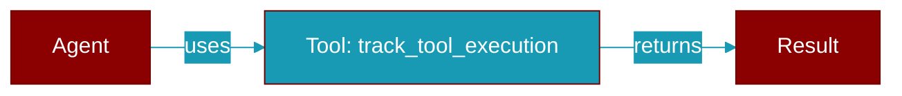

# track_tool_execution

<div className="flex items-center gap-2">
  <Badge color="purple">Method</Badge>
</div>

> This is a method of the [**MinimalTelemetry**](../classes/MinimalTelemetry) class in the [**telemetry_funcs**](../modules/telemetry_funcs) module.

Track tool execution



## Signature

```python
def track_tool_execution(&self, tool_name: &str, success: bool, duration_ms: u64) -> ()
```

## Parameters

<ParamField query="tool_name" type="&str" required={true}>
  No description available.
</ParamField>

<ParamField query="success" type="bool" required={true}>
  No description available.
</ParamField>

<ParamField query="duration_ms" type="u64" required={true}>
  No description available.
</ParamField>

### Returns

<ResponseField name="Returns" type="()">
  The result of the operation.
</ResponseField>


---

## Related Documentation

<CardGroup cols={2}>
  <Card title="Rust Tools" icon="wrench" href="/docs/rust/tools" />
  <Card title="Rust Code Execution" icon="terminal" href="/docs/rust/code-execution" />
  <Card title="Rust Web Search" icon="search" href="/docs/rust/web-search" />
</CardGroup>
