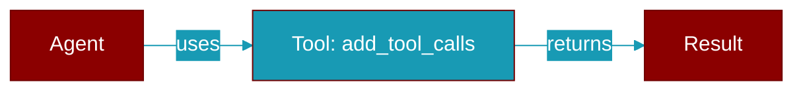

# add_tool_calls

<div className="flex items-center gap-2">
  <Badge color="purple">Method</Badge>
</div>

> This is a method of the [**MockLlmProvider**](../classes/MockLlmProvider) class in the [**llm**](../modules/llm) module.

Add tool calls to return with next response



## Signature

```python
def add_tool_calls(&self, calls: Vec<ToolCall>) -> ()
```

## Parameters

<ParamField query="calls" type="Vec&lt;ToolCall&gt;" required={true}>
  No description available.
</ParamField>

### Returns

<ResponseField name="Returns" type="()">
  The result of the operation.
</ResponseField>


---

## Related Documentation

<CardGroup cols={2}>
  <Card title="Tools Concept" icon="wrench" href="/docs/concepts/tools" />
  <Card title="Create Custom Tools" icon="plus" href="/docs/guides/tools/create-custom-tools" />
  <Card title="Tool Development" icon="code" href="/docs/tutorials/advanced-tool-development" />
</CardGroup>
