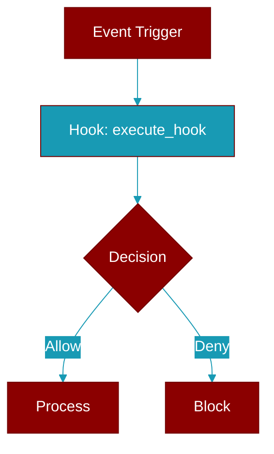

# execute_hook

<div className="flex items-center gap-2">
  <Badge color="purple">Method</Badge>
</div>

> This is a method of the [**PluginManager**](../classes/PluginManager) class in the [**plugins**](../modules/plugins) module.

Execute hooks for a specific hook type



## Signature

```python
def execute_hook(
        &self,
        hook: PluginHook,
        data: serde_json::Value,
    ) -> Result<serde_json::Value>
```

## Parameters

<ParamField query="hook" type="PluginHook" required={true}>
  No description available.
</ParamField>

<ParamField query="data" type="serde_json::Value" required={true}>
  No description available.
</ParamField>

### Returns

<ResponseField name="Returns" type="Result<serde_json::Value>">
  The result of the operation.
</ResponseField>


---

## Related Documentation

<CardGroup cols={2}>
  <Card title="Rust Hooks" icon="anchor" href="/docs/rust/hooks" />
</CardGroup>
