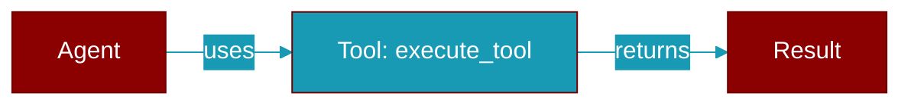

# execute_tool

<div className="flex items-center gap-2">
  <Badge color="purple">Method</Badge>
</div>

> This is a method of the [**ToolPluginProtocol**](../classes/ToolPluginProtocol) class in the [**plugins**](../modules/plugins) module.

Execute a tool by name



## Signature

```python
def execute_tool(&self, name: &str, args: serde_json::Value) -> Result<serde_json::Value, String>
```

## Parameters

<ParamField query="name" type="&str" required={true}>
  No description available.
</ParamField>

<ParamField query="args" type="serde_json::Value" required={true}>
  No description available.
</ParamField>

### Returns

<ResponseField name="Returns" type="Result<serde_json::Value, String>">
  The result of the operation.
</ResponseField>


---

## Related Documentation

<CardGroup cols={2}>
  <Card title="Rust Tools" icon="wrench" href="/docs/rust/tools" />
  <Card title="Rust Overview" icon="book-open" href="/docs/rust/overview" />
</CardGroup>
