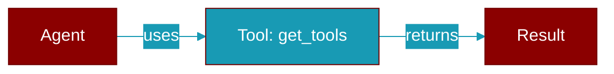

# get_tools

<div className="flex items-center gap-2">
  <Badge color="purple">Method</Badge>
</div>

> This is a method of the [**ToolPluginProtocol**](../classes/ToolPluginProtocol) class in the [**plugins**](../modules/plugins) module.

Get tool definitions provided by this plugin



## Signature

```python
def get_tools(&self) -> Vec<ToolDefinition>
```

### Returns

<ResponseField name="Returns" type="Vec<ToolDefinition>">
  The result of the operation.
</ResponseField>


---

## Related Documentation

<CardGroup cols={2}>
  <Card title="Rust Tools" icon="wrench" href="/docs/rust/tools" />
  <Card title="Rust Code Execution" icon="terminal" href="/docs/rust/code-execution" />
  <Card title="Rust Web Search" icon="search" href="/docs/rust/web-search" />
</CardGroup>
