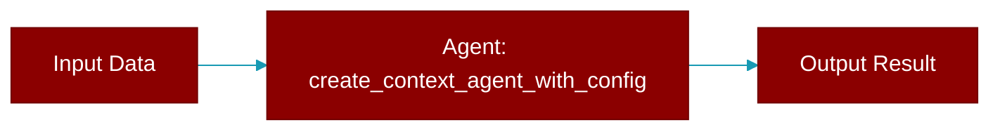

# create_context_agent_with_config

<div className="flex items-center gap-2">
  <Badge color="teal">Function</Badge>
</div>

> This function is defined in the [**specialized**](../modules/specialized) module.

Create a context agent with custom configuration



## Signature

```python
def create_context_agent_with_config(config: ContextAgentConfig) -> ContextAgent
```

## Parameters

<ParamField query="config" type="ContextAgentConfig" required={true}>
  No description available.
</ParamField>

### Returns

<ResponseField name="Returns" type="ContextAgent">
  The result of the operation.
</ResponseField>


## Source

<Card title="View on GitHub" icon="github" href="https://github.com/ARC-Solutions/praisonai-rust/blob/main/praisonai/src/parity/specialized.rs#L133">
  `praisonai/src/parity/specialized.rs` at line 133
</Card>


---

## Related Documentation

<CardGroup cols={2}>
  <Card title="Agents Concept" icon="robot" href="/docs/concepts/agents" />
  <Card title="Single Agent Guide" icon="book-open" href="/docs/guides/single-agent" />
  <Card title="Multi-Agent Guide" icon="users" href="/docs/guides/multi-agent" />
  <Card title="Agent Configuration" icon="gear" href="/docs/configuration/agent-config" />
  <Card title="Auto Agents" icon="wand-magic-sparkles" href="/docs/features/autoagents" />
</CardGroup>
