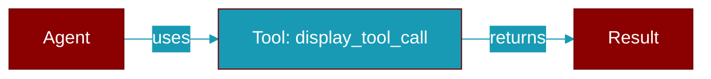

# display_tool_call

<div className="flex items-center gap-2">
  <Badge color="teal">Function</Badge>
</div>

> This function is defined in the [**display**](../modules/display) module.

Display a tool call



## Signature

```python
def display_tool_call(
    agent_name: &str,
    tool_name: &str,
    arguments: &serde_json::Value,
    result: Option<&str>,
) -> ()
```

## Parameters

<ParamField query="agent_name" type="&str" required={true}>
  No description available.
</ParamField>

<ParamField query="tool_name" type="&str" required={true}>
  No description available.
</ParamField>

<ParamField query="arguments" type="&serde_json::Value" required={true}>
  No description available.
</ParamField>

<ParamField query="result" type="Option&lt;&str&gt;" required={true}>
  No description available.
</ParamField>

### Returns

<ResponseField name="Returns" type="()">
  The result of the operation.
</ResponseField>


## Uses

- `agent`
- `tool`
- `args`
- `result`
- `execute_sync_callbacks`
- `read`
- `get`
- `is_none`


## Source

<Card title="View on GitHub" icon="github" href="https://github.com/MervinPraison/PraisonAI/blob/main/src/praisonai-rust/praisonai/src/display.rs#L444">
  `praisonai/src/display.rs` at line 444
</Card>


---

## Related Documentation

<CardGroup cols={2}>
  <Card title="Tools Concept" icon="wrench" href="/docs/concepts/tools" />
  <Card title="Create Custom Tools" icon="plus" href="/docs/guides/tools/create-custom-tools" />
  <Card title="Tool Development" icon="code" href="/docs/tutorials/advanced-tool-development" />
  <Card title="Display System" icon="display" href="/docs/features/display-system" />
  <Card title="Display Callbacks" icon="phone" href="/docs/features/display-callbacks" />
</CardGroup>
