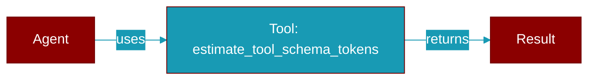

# estimate_tool_schema_tokens

<div className="flex items-center gap-2">
  <Badge color="teal">Function</Badge>
</div>

> This function is defined in the [**context**](../modules/context) module.

Estimate tokens for tool schemas.



## Signature

```python
def estimate_tool_schema_tokens(tools: &[serde_json::Value]) -> usize
```

## Parameters

<ParamField query="tools" type="&" required={true}>
  No description available.
</ParamField>

### Returns

<ResponseField name="Returns" type="usize">
  The result of the operation.
</ResponseField>


## Uses

- `unwrap_or_default`
- `estimate_tokens_heuristic`


## Source

<Card title="View on GitHub" icon="github" href="https://github.com/MervinPraison/PraisonAI/blob/main/src/praisonai-rust/praisonai/src/context/mod.rs#L344">
  `praisonai/src/context/mod.rs` at line 344
</Card>


---

## Related Documentation

<CardGroup cols={2}>
  <Card title="Tools Concept" icon="wrench" href="/docs/concepts/tools" />
  <Card title="Create Custom Tools" icon="plus" href="/docs/guides/tools/create-custom-tools" />
  <Card title="Tool Development" icon="code" href="/docs/tutorials/advanced-tool-development" />
</CardGroup>
