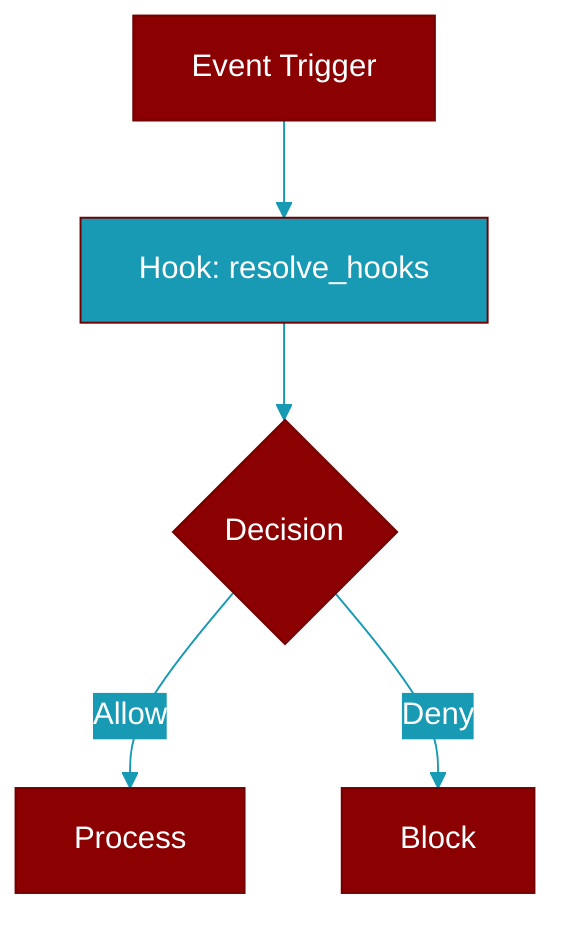

# resolve_hooks

<div className="flex items-center gap-2">
  <Badge color="teal">Function</Badge>
</div>

> This function is defined in the [**param_resolver**](../modules/param_resolver) module.

Resolve hooks parameter



## Signature

```python
def resolve_hooks(value: &serde_json::Value) -> ResolvedValue
```

## Parameters

<ParamField query="value" type="&serde_json::Value" required={true}>
  No description available.
</ParamField>

### Returns

<ResponseField name="Returns" type="ResolvedValue">
  The result of the operation.
</ResponseField>


## Uses

- `resolve`


## Source

<Card title="View on GitHub" icon="github" href="https://github.com/MervinPraison/PraisonAI/blob/main/src/praisonai-rust/praisonai/src/parity/param_resolver.rs#L526">
  `praisonai/src/parity/param_resolver.rs` at line 526
</Card>


---

## Related Documentation

<CardGroup cols={2}>
  <Card title="Rust Hooks" icon="anchor" href="/docs/rust/hooks" />
  <Card title="Rust Events" icon="bolt" href="/docs/rust/events" />
  <Card title="Rust Callbacks" icon="phone" href="/docs/rust/callbacks" />
</CardGroup>
