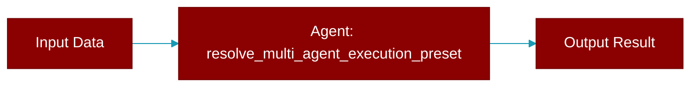

# resolve_multi_agent_execution_preset

<div className="flex items-center gap-2">
  <Badge color="teal">Function</Badge>
</div>

> This function is defined in the [**presets**](../modules/presets) module.

Resolve a multi-agent execution preset by name



## Signature

```python
def resolve_multi_agent_execution_preset(name: &str) -> Option<MultiAgentExecutionPreset>
```

## Parameters

<ParamField query="name" type="&str" required={true}>
  No description available.
</ParamField>

### Returns

<ResponseField name="Returns" type="Option<MultiAgentExecutionPreset>">
  The result of the operation.
</ResponseField>


## Uses

- `get`
- `cloned`


## Source

<Card title="View on GitHub" icon="github" href="https://github.com/MervinPraison/PraisonAI/blob/main/src/praisonai-rust/praisonai/src/presets.rs#L862">
  `praisonai/src/presets.rs` at line 862
</Card>


---

## Related Documentation

<CardGroup cols={2}>
  <Card title="Rust Overview" icon="book-open" href="/docs/rust/overview" />
  <Card title="Rust Quickstart" icon="rocket" href="/docs/rust/quickstart" />
  <Card title="Rust Agent Guide" icon="robot" href="/docs/rust/agent" />
  <Card title="Rust Installation" icon="download" href="/docs/rust/installation" />
</CardGroup>
