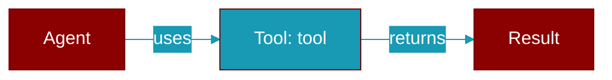

# tool

<div className="flex items-center gap-2">
  <Badge color="teal">Function</Badge>
</div>

> This function is defined in the [**praisonai_derive**](../modules/praisonai_derive) module.

The `#[tool]` attribute macro for defining tools. This macro transforms a function into a tool that can be used by agents. # Attributes - `description`: A description of what the tool does (required for LLM understanding) - `name`: Override the tool name (defaults to function name)



## Signature

```python
def tool(attr: TokenStream, item: TokenStream) -> TokenStream
```

## Parameters

<ParamField query="attr" type="TokenStream" required={true}>
  No description available.
</ParamField>

<ParamField query="item" type="TokenStream" required={true}>
  No description available.
</ParamField>

### Returns

<ResponseField name="Returns" type="TokenStream">
  The result of the operation.
</ResponseField>

## Usage

```python
use praisonai::tool;

#[tool(description = "Search the web")]
async fn search(query: String) -> String {
format!("Results for: {}", query)
}

// With custom name
#[tool(name = "web_search", description = "Search the internet")]
async fn my_search_fn(query: String, max_results: u32) -> Vec<String> {
vec![format!("Result for: {}", query)]
}
```


## Uses

- `parser`
- `is_ident`
- `value`
- `parse`
- `error`
- `name`
- `unwrap_or_else`
- `path`
- `push_str`
- `trim`


## Source

<Card title="View on GitHub" icon="github" href="https://github.com/MervinPraison/PraisonAI/blob/main/src/praisonai-rust/praisonai-derive/src/lib.rs#L46">
  `praisonai-derive/src/lib.rs` at line 46
</Card>


---

## Related Documentation

<CardGroup cols={2}>
  <Card title="Rust Tools" icon="wrench" href="/docs/rust/tools" />
  <Card title="Rust Overview" icon="book-open" href="/docs/rust/overview" />
</CardGroup>
