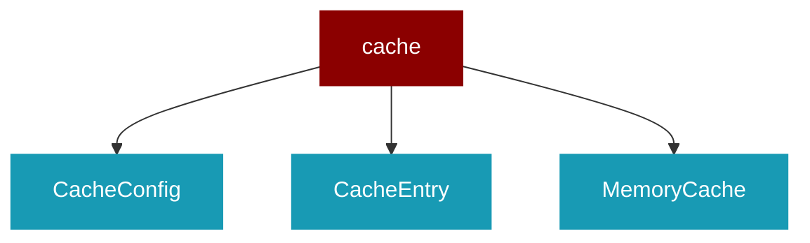

# cache

<Badge color="green">TypeScript</Badge>

## Overview



* Cache System - In-memory and persistent caching for agents
Inspired by mastra's cache module

## Import

```typescript
import { cache } from 'praisonai';
```

## Classes

<AccordionGroup>
### CacheConfig

TypeScript CacheConfig class

### CacheEntry

TypeScript CacheEntry class

### MemoryCache

*Extends: BaseCache*

TypeScript MemoryCache class

### FileCache

*Extends: BaseCache*

TypeScript FileCache class

</AccordionGroup>

## Functions

<AccordionGroup>
### createMemoryCache()

```typescript
function createMemoryCache(config?: CacheConfig): MemoryCache
```

### createFileCache()

```typescript
function createFileCache(config?: CacheConfig & { cacheDir?: string }): FileCache
```

</AccordionGroup>
