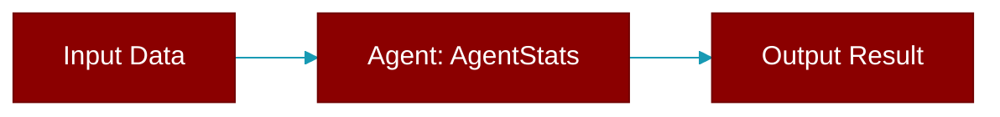

# AgentStats

> Defined in the [**telemetry**](../modules/telemetry) module.

<Badge color="green">TypeScript AI Agent</Badge>

TypeScript AgentStats class

```mermaid
%%{init: {'theme': 'base', 'themeVariables': { 'primaryColor': '#8B0000', 'primaryTextColor': '#fff', 'primaryBorderColor': '#710101', 'lineColor': '#189AB4', 'secondaryColor': '#189AB4', 'tertiaryColor': '#fff' }}}%%

graph LR
    input["Input Data"] --> agent["Agent: AgentStats"]
    agent --> output["Output Result"]
    style agent fill:#8B0000,color:#fff
    style input fill:#8B0000,color:#fff
    style output fill:#8B0000,color:#fff
```
