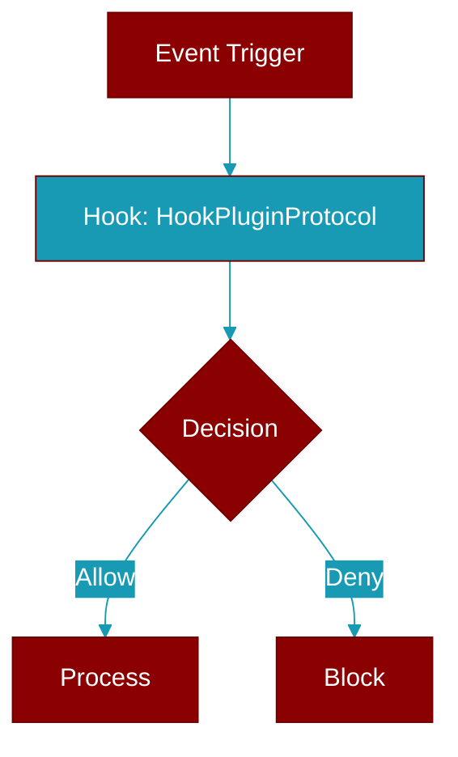

# HookPluginProtocol

> Defined in the [**plugins**](../modules/plugins) module.

<Badge color="green">TypeScript AI Agent</Badge>

TypeScript HookPluginProtocol class

```mermaid
%%{init: {'theme': 'base', 'themeVariables': { 'primaryColor': '#8B0000', 'primaryTextColor': '#fff', 'primaryBorderColor': '#710101', 'lineColor': '#189AB4', 'secondaryColor': '#189AB4', 'tertiaryColor': '#fff' }}}%%

graph TD
    event["Event Trigger"] --> hook["Hook: HookPluginProtocol"]
    hook --> decision{"Decision"}
    decision -- "Allow" --> proc["Process"]
    decision -- "Deny" --> block["Block"]
    style hook fill:#189AB4,color:#fff
    style event fill:#8B0000,color:#fff
    style proc fill:#8B0000,color:#fff
    style block fill:#8B0000,color:#fff
```
