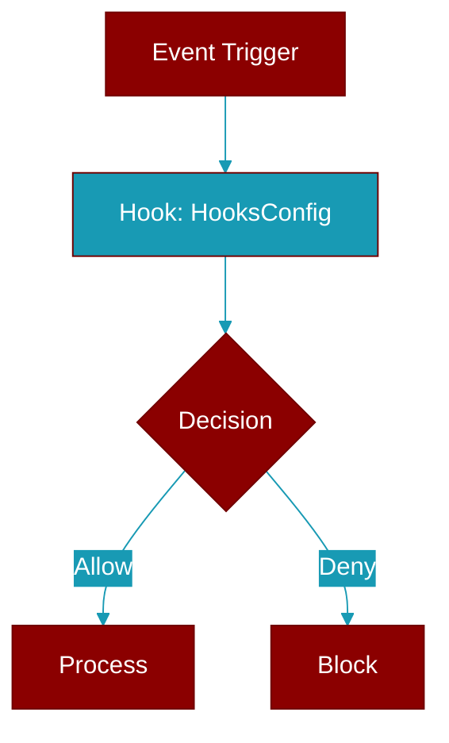

# HooksConfig

> Defined in the [**config**](../modules/config) module.

<Badge color="green">TypeScript AI Agent</Badge>

TypeScript HooksConfig class

---

## Related Documentation

<CardGroup cols={2}>
  <Card title="TypeScript SDK" icon="book-open" href="/docs/sdk/typescript/index" />
  <Card title="Observability" icon="eye" href="/docs/sdk/typescript/observability" />
</CardGroup>
