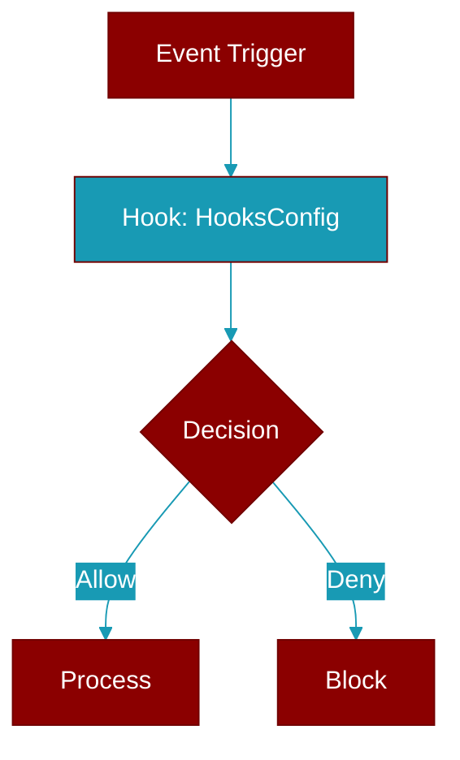

# HooksConfig

> Defined in the [**config**](../modules/config) module.

<Badge color="green">TypeScript AI Agent</Badge>

TypeScript HooksConfig class

## Source

<Card title="View on GitHub" icon="github" href="https://github.com/MervinPraison/PraisonAI/blob/main/src/praisonai-ts/src/config/index.ts#L253">
  `src/config/index.ts` at line 253
</Card>

---

## Related Documentation

<CardGroup cols={2}>
  <Card title="JS Hooks Manager" icon="anchor" href="/docs/js/hooks-manager" />
  <Card title="JS Memory Hooks" icon="database" href="/docs/js/memory-hooks" />
  <Card title="JS Workflow Hooks" icon="diagram-project" href="/docs/js/workflow-hooks" />
  <Card title="TypeScript Guide" icon="book-open" href="/docs/js/typescript" />
  <Card title="JS Development" icon="code" href="/docs/js/development" />
</CardGroup>
