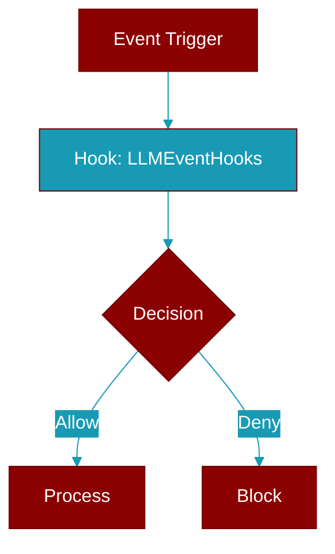

# LLMEventHooks

> Defined in the [**LLM**](../modules/llm) module.

<Badge color="green">TypeScript AI Agent</Badge>

TypeScript LLMEventHooks class

## Source

<Card title="View on GitHub" icon="github" href="https://github.com/MervinPraison/PraisonAI/blob/main/src/praisonai-ts/src/llm/index.ts#L70">
  `src/llm/index.ts` at line 70
</Card>

---

## Related Documentation

<CardGroup cols={2}>
  <Card title="JS Hooks Manager" icon="anchor" href="/docs/js/hooks-manager" />
  <Card title="JS Memory Hooks" icon="database" href="/docs/js/memory-hooks" />
  <Card title="JS Workflow Hooks" icon="diagram-project" href="/docs/js/workflow-hooks" />
  <Card title="JS Events" icon="bolt" href="/docs/js/events" />
  <Card title="JS Providers" icon="server" href="/docs/js/providers" />
</CardGroup>
