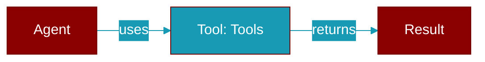

# Tools

> Defined in the [**protocols**](../modules/protocols) module.

<Badge color="green">TypeScript AI Agent</Badge>

TypeScript Tools class

## Source

<Card title="View on GitHub" icon="github" href="https://github.com/MervinPraison/PraisonAI/blob/main/src/praisonai-ts/src/protocols/index.ts#L355">
  `src/protocols/index.ts` at line 355
</Card>

---

## Related Documentation

<CardGroup cols={2}>
  <Card title="TypeScript SDK" icon="book-open" href="/docs/sdk/typescript/index" />
  <Card title="Planning" icon="diagram-project" href="/docs/sdk/typescript/planning" />
</CardGroup>
