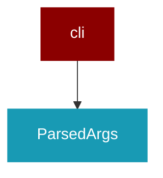

# cli

<Badge color="green">TypeScript</Badge>

## Overview



## Import

```typescript
import { cli } from 'praisonai';
```

## Classes

<AccordionGroup>
### ParsedArgs

TypeScript ParsedArgs class

</AccordionGroup>
