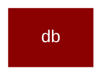

# db

<Badge color="green">TypeScript</Badge>

## Overview



* Database Module - Exports for persistence layer
* Usage (Python-like simplicity):
import &#123; db &#125; from 'praisonai';
*   const agent = new Agent(&#123;
instructions: "You are helpful",
db: db("sqlite:./data.db"),  // URL-style string
sessionId: "my-session"
&#125;);

## Import

```typescript
import { db } from 'praisonai';
```

## Functions

### createDbAdapter()

```typescript
function createDbAdapter(config: DbConfig): DbAdapter
```

### getDefaultDbAdapter()

```typescript
function getDefaultDbAdapter(): DbAdapter
```

### setDefaultDbAdapter()

```typescript
function setDefaultDbAdapter(adapter: DbAdapter): void
```

### db()

```typescript
function db(configOrUrl: string | DbConfig = { type: 'memory' }): DbAdapter
```

