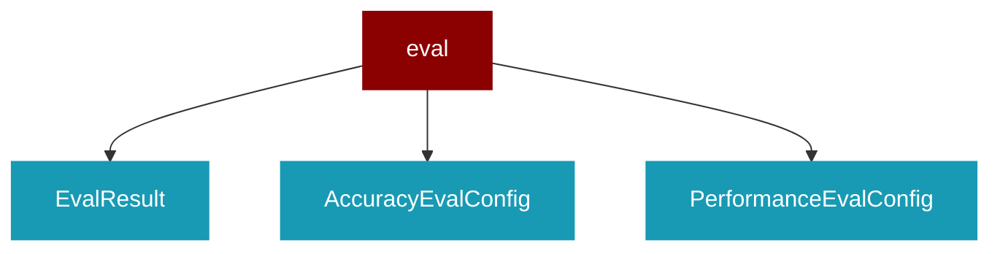

# eval

<Badge color="green">TypeScript</Badge>

## Overview



* Evaluation Framework - Accuracy, Performance, and Reliability evaluation

## Import

```typescript
import { eval } from 'praisonai';
```

## Classes

### EvalResult

TypeScript EvalResult class

### AccuracyEvalConfig

TypeScript AccuracyEvalConfig class

### PerformanceEvalConfig

TypeScript PerformanceEvalConfig class

### PerformanceResult

*Extends: EvalResult*

TypeScript PerformanceResult class

### ReliabilityEvalConfig

TypeScript ReliabilityEvalConfig class

### EvalSuite

TypeScript EvalSuite class


## Functions

### accuracyEval()

```typescript
async function accuracyEval(config: AccuracyEvalConfig): Promise<EvalResult>
```

### performanceEval()

```typescript
async function performanceEval(config: PerformanceEvalConfig): Promise<PerformanceResult>
```

### reliabilityEval()

```typescript
async function reliabilityEval(config: ReliabilityEvalConfig): Promise<EvalResult>
```

