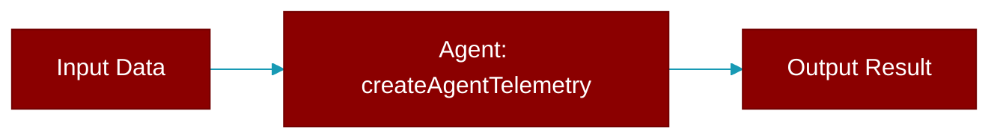

<div className="flex items-center gap-2">
  <Badge color="teal">Function</Badge>
</div>

> This function is defined in the [**telemetry**](../modules/telemetry) module.




## Signature

```python
def createAgentTelemetry(agentName: string, config?: TelemetryConfig) -> AgentTelemetry
```

### Returns

<ResponseField name="Returns" type="AgentTelemetry">
  The result of the operation.
</ResponseField>
