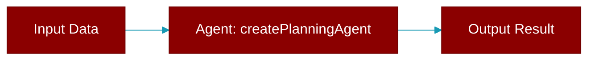

# createPlanningAgent

<div className="flex items-center gap-2">
  <Badge color="teal">Function</Badge>
</div>

> This function is defined in the [**planning**](../modules/planning) module.




## Signature

```python
def createPlanningAgent(config?: PlanningAgentConfig) -> PlanningAgent
```

### Returns

<ResponseField name="Returns" type="PlanningAgent">
  The result of the operation.
</ResponseField>


## Uses

- `PlanningAgent`


## Source

<Card title="View on GitHub" icon="github" href="https://github.com/MervinPraison/PraisonAI/blob/main/src/praisonai-ts/src/planning/index.ts#L691">
  `src/planning/index.ts` at line 691
</Card>


---

## Related Documentation

<CardGroup cols={2}>
  <Card title="JS Agent Guide" icon="robot" href="/docs/js/agent" />
  <Card title="JS Agents" icon="users" href="/docs/js/agents" />
  <Card title="JS Auto Agents" icon="wand-magic-sparkles" href="/docs/js/auto-agents" />
  <Card title="JS Agent Team" icon="users" href="/docs/js/agent-team" />
  <Card title="JS Agent Flow" icon="diagram-project" href="/docs/js/agent-flow" />
</CardGroup>
