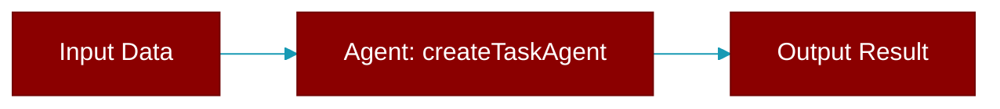

# createTaskAgent

<div className="flex items-center gap-2">
  <Badge color="teal">Function</Badge>
</div>

> This function is defined in the [**planning**](../modules/planning) module.




## Signature

```python
def createTaskAgent(config?: { name?: string; llm?: string; verbose?: boolean }) -> TaskAgent
```

### Returns

<ResponseField name="Returns" type="TaskAgent">
  The result of the operation.
</ResponseField>


---

## Related Documentation

<CardGroup cols={2}>
  <Card title="TypeScript Overview" icon="book-open" href="/docs/typescript/overview" />
  <Card title="TypeScript Quickstart" icon="rocket" href="/docs/typescript/quickstart" />
  <Card title="TypeScript Agent" icon="robot" href="/docs/typescript/agent" />
  <Card title="TypeScript AgentTeam" icon="users" href="/docs/typescript/agentteam" />
</CardGroup>
