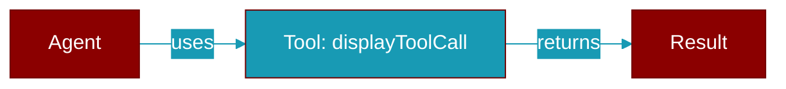

# displayToolCall

<div className="flex items-center gap-2">
  <Badge color="teal">Function</Badge>
</div>

> This function is defined in the [**parity**](../modules/parity) module.




## Signature

```python
def displayToolCall(toolName: string, args: any) -> void
```

### Returns

<ResponseField name="Returns" type="void">
  The result of the operation.
</ResponseField>


## Uses

- `stringify`


## Source

<Card title="View on GitHub" icon="github" href="https://github.com/MervinPraison/PraisonAI/blob/main/src/praisonai-ts/src/parity/index.ts#L1153">
  `src/parity/index.ts` at line 1153
</Card>


---

## Related Documentation

<CardGroup cols={2}>
  <Card title="TypeScript SDK" icon="book-open" href="/docs/sdk/typescript/index" />
  <Card title="Planning" icon="diagram-project" href="/docs/sdk/typescript/planning" />
</CardGroup>
