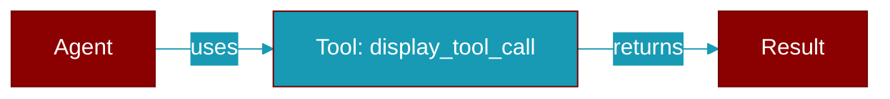

# display_tool_call

<div className="flex items-center gap-2">
  <Badge color="teal">Function</Badge>
</div>

> This function is defined in the [**parity**](../modules/parity) module.




## Signature

```python
def display_tool_call(tool: string, args: any, result?: any) -> void
```

### Returns

<ResponseField name="Returns" type="void">
  The result of the operation.
</ResponseField>


---

## Related Documentation

<CardGroup cols={2}>
  <Card title="TypeScript SDK" icon="book-open" href="/docs/sdk/typescript/index" />
  <Card title="Planning" icon="diagram-project" href="/docs/sdk/typescript/planning" />
</CardGroup>
