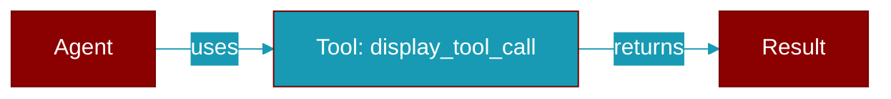

# display_tool_call

<div className="flex items-center gap-2">
  <Badge color="teal">Function</Badge>
</div>

> This function is defined in the [**parity**](../modules/parity) module.




## Signature

```python
def display_tool_call(tool: string, args: any, result?: any) -> void
```

### Returns

<ResponseField name="Returns" type="void">
  The result of the operation.
</ResponseField>


## Uses

- `cb`


## Source

<Card title="View on GitHub" icon="github" href="https://github.com/MervinPraison/PraisonAI/blob/main/src/praisonai-ts/src/parity/index.ts#L1799">
  `src/parity/index.ts` at line 1799
</Card>


---

## Related Documentation

<CardGroup cols={2}>
  <Card title="JS Tools" icon="wrench" href="/docs/js/tools" />
  <Card title="JS Tools CLI" icon="terminal" href="/docs/js/tools-cli" />
  <Card title="JS Custom Tools" icon="plus" href="/docs/js/customtools" />
  <Card title="JS MCP Tools" icon="plug" href="/docs/js/mcp-tools" />
</CardGroup>
