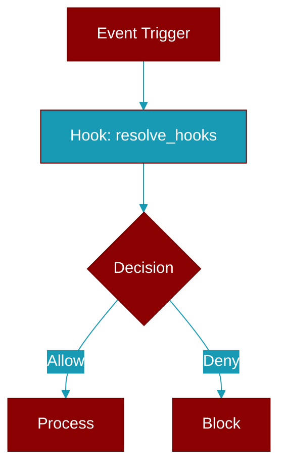

# resolve_hooks

<div className="flex items-center gap-2">
  <Badge color="teal">Function</Badge>
</div>

> This function is defined in the [**config**](../modules/config) module.




## Signature

```python
def resolve_hooks(input: boolean | HooksConfig | undefined) -> HooksConfig | undefined
```

### Returns

<ResponseField name="Returns" type="HooksConfig | undefined">
  The result of the operation.
</ResponseField>


## Source

<Card title="View on GitHub" icon="github" href="https://github.com/MervinPraison/PraisonAI/blob/main/src/praisonai-ts/src/src/config/index.ts#L835">
  `src/config/index.ts` at line 835
</Card>
