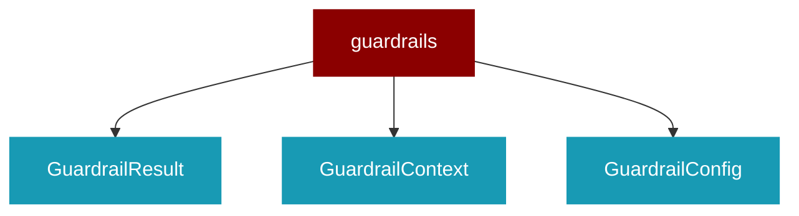

# guardrails

<Badge color="green">TypeScript</Badge>

## Overview



* Guardrails - Input/output validation and safety checks

## Import

```typescript
import { guardrails } from 'praisonai';
```

## Classes

<AccordionGroup>
### GuardrailResult

TypeScript GuardrailResult class

### GuardrailContext

TypeScript GuardrailContext class

### GuardrailConfig

TypeScript GuardrailConfig class

### Guardrail

TypeScript Guardrail class

### GuardrailManager

TypeScript GuardrailManager class

</AccordionGroup>

## Functions

<AccordionGroup>
### guardrail()

```typescript
function guardrail(config: GuardrailConfig): Guardrail
```

</AccordionGroup>
