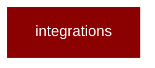

# integrations

<Badge color="green">TypeScript</Badge>

## Overview



* PraisonAI Integrations
Extensions for vector stores, observability, and voice

## Import

```typescript
import { integrations } from 'praisonai';
```
