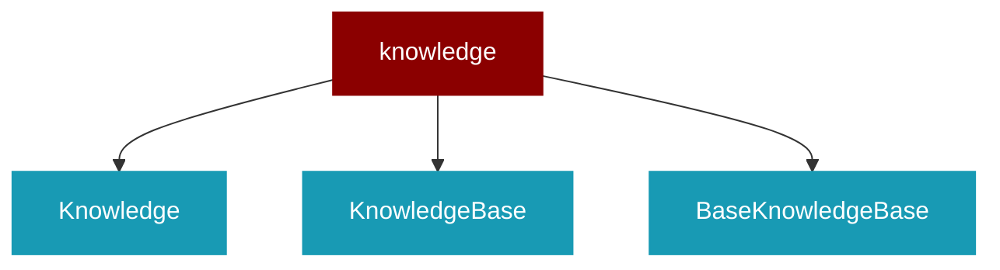

# knowledge

<Badge color="green">TypeScript</Badge>

## Overview



## Import

```typescript
import { knowledge } from 'praisonai';
```

## Classes

### Knowledge

TypeScript Knowledge class

### KnowledgeBase

TypeScript KnowledgeBase class

### BaseKnowledgeBase

TypeScript BaseKnowledgeBase class

