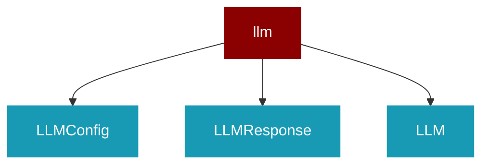

# llm

<Badge color="green">TypeScript</Badge>

## Overview



## Import

```typescript
import { llm } from 'praisonai';
```

## Classes

### LLMConfig

TypeScript LLMConfig class

### LLMResponse

TypeScript LLMResponse class

### LLM

TypeScript LLM class

### BaseLLM

TypeScript BaseLLM class

