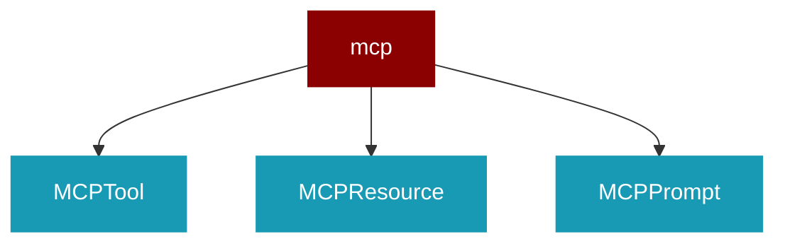

# mcp

<Badge color="green">TypeScript</Badge>

## Overview



* MCP (Model Context Protocol) Integration
* Provides client and server implementations for MCP,
enabling tool discovery and invocation across processes.
* 
```typescript
import { MCPClient } from 'praisonai';
* const client = new MCPClient({ serverUrl: 'http://localhost:3000' });
await client.connect();
* const tools = await client.listTools();
const result = await client.callTool('search', { query: 'AI' });
```
* 
```typescript
import { Agent, MCPClient } from 'praisonai';
* const mcp = new MCPClient({ serverUrl: 'http://localhost:3000' });
await mcp.connect();
* const agent = new Agent({
instructions: 'Use available tools',
tools: await mcp.getToolsAsAISDK()
});
```

## Import

```typescript
import { mcp } from 'praisonai';
```

## Classes

### MCPTool

TypeScript MCPTool class

### MCPResource

TypeScript MCPResource class

### MCPPrompt

TypeScript MCPPrompt class

### MCPClientConfig

TypeScript MCPClientConfig class

### MCPToolResult

TypeScript MCPToolResult class

### MCPSession

TypeScript MCPSession class

### MCPClient

TypeScript MCPClient class


## Functions

### createMCPClient()

```typescript
function createMCPClient(config?: MCPClientConfig): MCPClient
```

### getMCPTools()

```typescript
async function getMCPTools(config: MCPClientConfig): Promise<
```

