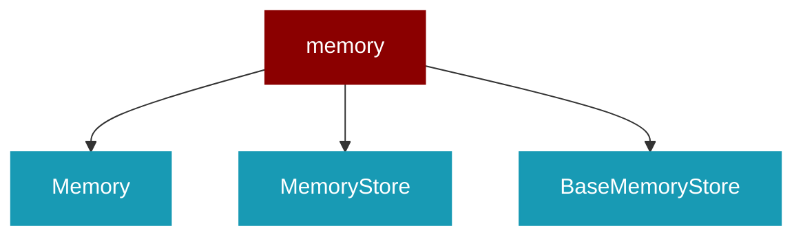

# memory

<Badge color="green">TypeScript</Badge>

## Overview



## Import

```typescript
import { memory } from 'praisonai';
```

## Classes

<AccordionGroup>
### Memory

TypeScript Memory class

### MemoryStore

TypeScript MemoryStore class

### BaseMemoryStore

TypeScript BaseMemoryStore class

</AccordionGroup>
