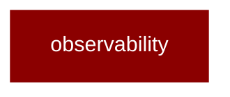

# observability

<Badge color="green">TypeScript</Badge>

## Overview



* Observability Module - Unified tracing, logging, and metrics
* Supports 14+ observability integrations:
- Langfuse, LangSmith, LangWatch
- Arize AX, Axiom, Braintrust
- Helicone, Laminar, Maxim
- Patronus, Scorecard, SigNoz
- Traceloop, Weave
* 
```typescript
import { createObservabilityAdapter, setObservabilityAdapter } from 'praisonai';
* // Enable observability
const adapter = await createObservabilityAdapter('langfuse');
setObservabilityAdapter(adapter);
* // Use with agents
const agent = new Agent({ 
instructions: "You are helpful"
});
```

## Import

```typescript
import { observability } from 'praisonai';
```

## Functions

### setObservabilityAdapter()

```typescript
function setObservabilityAdapter(adapter: ObservabilityAdapter): void
```

### getObservabilityAdapter()

```typescript
function getObservabilityAdapter(): ObservabilityAdapter
```

### resetObservabilityAdapter()

```typescript
function resetObservabilityAdapter(): void
```

### trace()

```typescript
function trace(toolName: string = 'memory'): void
```

