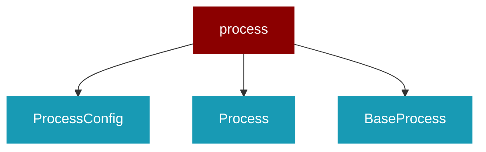

# process

<Badge color="green">TypeScript</Badge>

## Overview



## Import

```typescript
import { process } from 'praisonai';
```

## Classes

<AccordionGroup>
### ProcessConfig

TypeScript ProcessConfig class

### Process

TypeScript Process class

### BaseProcess

TypeScript BaseProcess class

</AccordionGroup>
