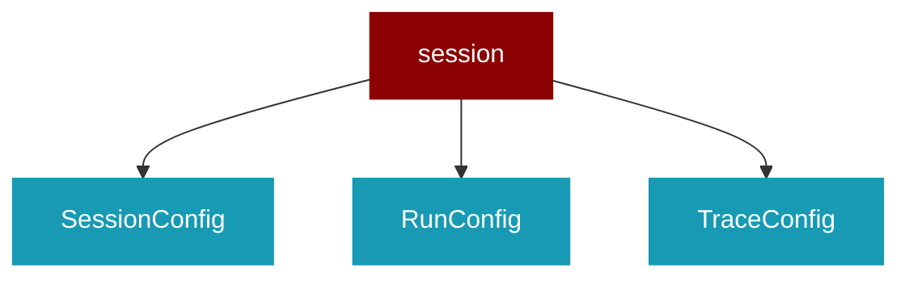

# session

<Badge color="green">TypeScript</Badge>

## Overview



* Session Management - Session, Run, and Trace tracking

## Import

```typescript
import { session } from 'praisonai';
```

## Classes

### SessionConfig

TypeScript SessionConfig class

### RunConfig

TypeScript RunConfig class

### TraceConfig

TypeScript TraceConfig class

### Message

TypeScript Message class

### Trace

TypeScript Trace class

### Run

TypeScript Run class

### Session

TypeScript Session class

### SessionManager

TypeScript SessionManager class


## Functions

### getSessionManager()

```typescript
function getSessionManager(): SessionManager
```

