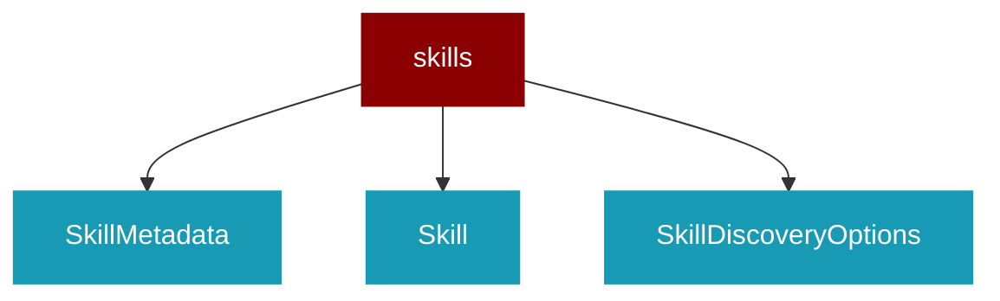

# skills

<Badge color="green">TypeScript</Badge>

## Overview



* Skills System - Agent Skills standard implementation

## Import

```typescript
import { skills } from 'praisonai';
```

## Classes

### SkillMetadata

TypeScript SkillMetadata class

### Skill

TypeScript Skill class

### SkillDiscoveryOptions

TypeScript SkillDiscoveryOptions class

### SkillManager

TypeScript SkillManager class


## Functions

### parseSkillFile()

```typescript
function parseSkillFile(content: string): Skill
```

### createSkillManager()

```typescript
function createSkillManager(options?: SkillDiscoveryOptions): SkillManager
```

