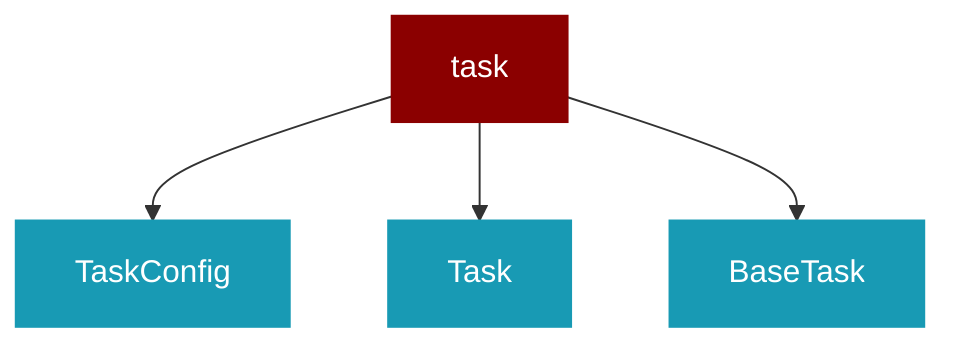

# task

<Badge color="green">TypeScript</Badge>

## Overview



## Import

```typescript
import { task } from 'praisonai';
```

## Classes

### TaskConfig

TypeScript TaskConfig class

### Task

TypeScript Task class

### BaseTask

TypeScript BaseTask class

