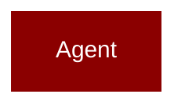

# telemetry

<Badge color="green">TypeScript</Badge>

## Overview



* Telemetry - Usage tracking and analytics

## Import

```typescript
import { telemetry } from 'praisonai';
```

## Classes

### TelemetryEvent

TypeScript TelemetryEvent class

### TelemetryConfig

TypeScript TelemetryConfig class

### TelemetryCollector

TypeScript TelemetryCollector class

### AgentStats

TypeScript AgentStats class

### AgentTelemetry

TypeScript AgentTelemetry class


## Functions

### getTelemetry()

```typescript
function getTelemetry(): TelemetryCollector
```

### enableTelemetry()

```typescript
function enableTelemetry(): void
```

### disableTelemetry()

```typescript
function disableTelemetry(): void
```

### cleanupTelemetry()

```typescript
function cleanupTelemetry(): void
```

### createAgentTelemetry()

```typescript
function createAgentTelemetry(agentName: string, config?: TelemetryConfig): AgentTelemetry
```

