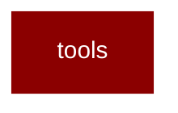

# tools

<Badge color="green">TypeScript</Badge>

## Overview


```mermaid
graph TD
    Module["tools"]:::agent
    classDef agent fill:#8B0000,stroke:#8B0000,color:#fff
```

## Import

```typescript
import { tools } from 'praisonai';
```
