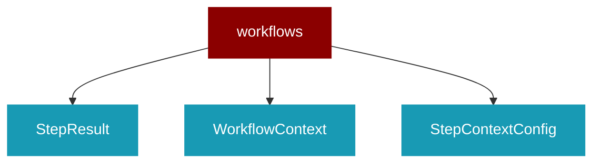

# workflows

<Badge color="green">TypeScript</Badge>

## Overview



* Workflows - Pipeline and orchestration patterns

## Import

```typescript
import { workflows } from 'praisonai';
```

## Classes

<AccordionGroup>
### StepResult

TypeScript StepResult class

### WorkflowContext

TypeScript WorkflowContext class

### StepContextConfig

TypeScript StepContextConfig class

### StepOutputConfig

TypeScript StepOutputConfig class

### StepExecutionConfig

TypeScript StepExecutionConfig class

### StepRoutingConfig

TypeScript StepRoutingConfig class

### WorkflowStepConfig

TypeScript WorkflowStepConfig class

### WorkflowStep

TypeScript WorkflowStep class

### Workflow

TypeScript Workflow class

</AccordionGroup>
