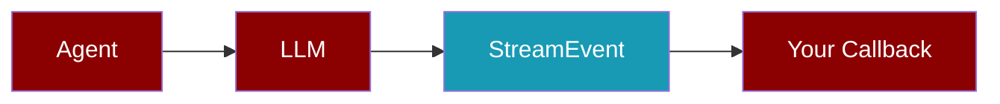
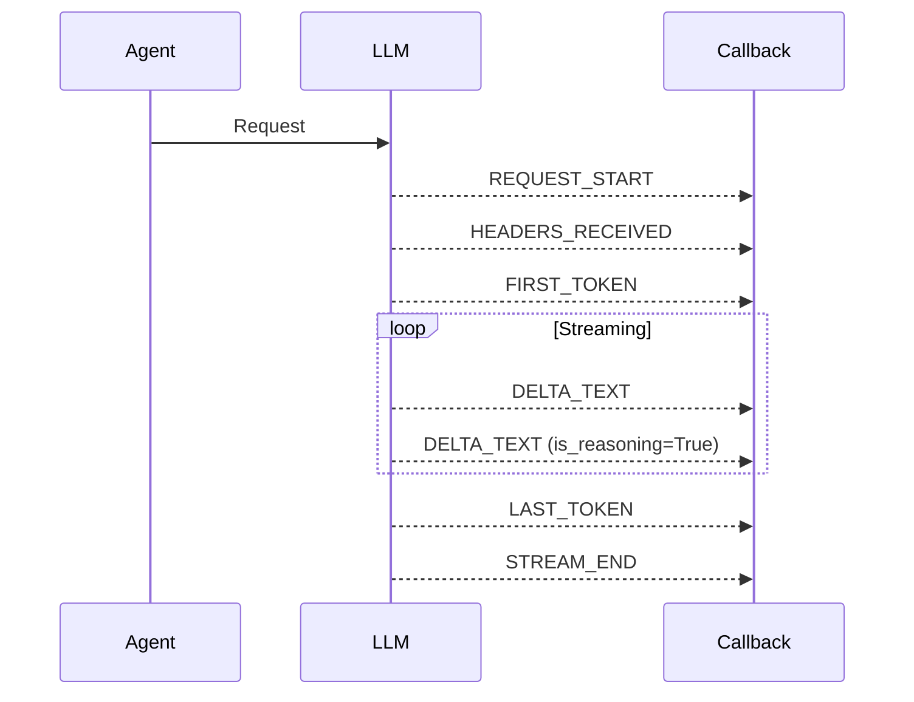

Stream LLM responses in real-time with full control over text, tool calls, and reasoning content.



## Quick Start

<CodeGroup>
```python Basic Streaming
from praisonaiagents import Agent
from praisonaiagents.streaming import StreamEvent, StreamEventType

def my_callback(event: StreamEvent):
    if event.type == StreamEventType.DELTA_TEXT:
        print(event.content, end="", flush=True)

agent = Agent(name="assistant")
agent.stream_emitter.add_callback(my_callback)
response = agent.start("Hello!", stream=True)
```

```python With Reasoning
from praisonaiagents import Agent
from praisonaiagents.streaming import StreamEvent, StreamEventType

def my_callback(event: StreamEvent):
    if event.type == StreamEventType.DELTA_TEXT:
        if event.is_reasoning:
            # Style reasoning content differently (dim gray)
            print(f"\033[90m{event.content}\033[0m", end="")
        else:
            print(event.content, end="")

agent = Agent(name="thinker", llm="o1-mini")
agent.stream_emitter.add_callback(my_callback)
response = agent.start("Think step by step...", stream=True)
```
</CodeGroup>

## StreamEvent

Every streaming chunk is wrapped in a `StreamEvent` with full context.

<Accordion title="StreamEvent Fields">

| Field | Type | Default | Description |
|-------|------|---------|-------------|
| `type` | `StreamEventType` | Required | Event type (see below) |
| `timestamp` | `float` | Auto | High-precision timestamp |
| `content` | `str` | `None` | Text content for DELTA_TEXT |
| `tool_call` | `dict` | `None` | Tool call data |
| `metadata` | `dict` | `None` | Additional metadata |
| `error` | `str` | `None` | Error message |
| `is_reasoning` | `bool` | `False` | Whether content is reasoning/thinking |
| `agent_id` | `str` | `None` | Agent identifier (multi-agent) |
| `session_id` | `str` | `None` | Session identifier |
| `run_id` | `str` | `None` | Run identifier |

</Accordion>

## Event Types



<CardGroup cols={3}>
  <Card title="REQUEST_START" icon="play">
    Before API call is made
  </Card>
  <Card title="HEADERS_RECEIVED" icon="signal">
    HTTP 200 headers arrive
  </Card>
  <Card title="FIRST_TOKEN" icon="bolt">
    First content delta (TTFT marker)
  </Card>
  <Card title="DELTA_TEXT" icon="text">
    Text content chunk
  </Card>
  <Card title="DELTA_TOOL_CALL" icon="wrench">
    Tool call chunk
  </Card>
  <Card title="STREAM_END" icon="flag-checkered">
    Stream completed
  </Card>
</CardGroup>

## Reasoning Content

Models like `o1`, `o1-mini`, and `deepseek-reasoner` emit reasoning/thinking content before the final answer.

<Tabs>
  <Tab title="Detect Reasoning">
```python
def callback(event: StreamEvent):
    if event.type == StreamEventType.DELTA_TEXT:
        if event.is_reasoning:
            # This is thinking/reasoning content
            print(f"[Thinking] {event.content}")
        else:
            # This is the actual response
            print(event.content, end="")
```
  </Tab>
  <Tab title="Style Differently">
```python
def callback(event: StreamEvent):
    if event.type == StreamEventType.DELTA_TEXT:
        if event.is_reasoning:
            # Dim gray for reasoning
            print(f"\033[90m{event.content}\033[0m", end="")
        else:
            # Normal for response
            print(event.content, end="")
```
  </Tab>
  <Tab title="Collect Separately">
```python
reasoning_parts = []
response_parts = []

def callback(event: StreamEvent):
    if event.type == StreamEventType.DELTA_TEXT:
        if event.is_reasoning:
            reasoning_parts.append(event.content)
        else:
            response_parts.append(event.content)

# After streaming:
full_reasoning = "".join(reasoning_parts)
full_response = "".join(response_parts)
```
  </Tab>
</Tabs>

## Multi-Agent Context

In multi-agent workflows, identify which agent emitted each event.

```python
def callback(event: StreamEvent):
    if event.agent_id:
        print(f"[{event.agent_id}] ", end="")
    
    if event.type == StreamEventType.DELTA_TEXT:
        print(event.content, end="")
```

<Accordion title="Context Fields">

| Field | Use Case |
|-------|----------|
| `agent_id` | Identify agent in multi-agent workflows |
| `session_id` | Track conversation sessions |
| `run_id` | Correlate events within a single run |

</Accordion>

## StreamMetrics

Track streaming performance with built-in metrics.

```python
from praisonaiagents.streaming import StreamMetrics

metrics = StreamMetrics()

def callback(event: StreamEvent):
    metrics.update_from_event(event)
    if event.type == StreamEventType.DELTA_TEXT:
        print(event.content, end="")

# After streaming:
print(metrics.format_summary())
# Output: TTFT: 245ms | Stream: 1200ms | Total: 1445ms | Tokens: 150 (125.0/s)
```

<Accordion title="Metrics Properties">

| Property | Description |
|----------|-------------|
| `ttft` | Time To First Token (seconds) |
| `stream_duration` | Token streaming duration |
| `total_time` | End-to-end request time |
| `tokens_per_second` | Token generation rate |

</Accordion>

## StreamEventEmitter

Each agent has its own emitter for thread-safe streaming.

```python
from praisonaiagents import Agent

agent = Agent(name="assistant")

# Add sync callback
agent.stream_emitter.add_callback(my_sync_callback)

# Add async callback
agent.stream_emitter.add_async_callback(my_async_callback)

# Enable metrics
agent.stream_emitter.enable_metrics()

# After streaming
metrics = agent.stream_emitter.get_metrics()
```

## Built-in Callbacks

<CodeGroup>
```python Text Printer
from praisonaiagents.streaming import create_text_printer_callback

# Simple text printer
callback = create_text_printer_callback(flush=True)
agent.stream_emitter.add_callback(callback)
```

```python Metrics Collector
from praisonaiagents.streaming import create_metrics_callback, StreamMetrics

metrics = StreamMetrics()
callback = create_metrics_callback(metrics)
agent.stream_emitter.add_callback(callback)
```

```python Logging Callback
from praisonaiagents.streaming import create_logging_callback

logger, callback = create_logging_callback(verbose=True, metrics=True)
agent.stream_emitter.add_callback(callback)

# After streaming
print(logger.get_metrics_summary())
```
</CodeGroup>

## Provider Support

Streaming with reasoning content is supported across providers:

| Provider | Streaming | Reasoning | Notes |
|----------|-----------|-----------|-------|
| OpenAI | ✅ | ✅ | `o1`, `o1-mini` models |
| LiteLLM | ✅ | ✅ | Via `provider_specific_fields` |
| Gemini | ✅ | ❌ | Standard streaming only |

<Tip>
LiteLLM automatically extracts reasoning content from `provider_specific_fields.reasoning_content` and emits it as `StreamEvent(is_reasoning=True)`.
</Tip>

## Best Practices

<Steps>
  <Step title="Use is_reasoning for UI">
    Style reasoning content differently (collapsed, dimmed, or hidden)
  </Step>
  <Step title="Track Metrics">
    Monitor TTFT and tokens/second for performance optimization
  </Step>
  <Step title="Handle Errors">
    Check for `StreamEventType.ERROR` events
  </Step>
  <Step title="Multi-Agent Safety">
    Each agent has its own emitter - no shared state
  </Step>
</Steps>

<Warning>
Don't let callback errors break streaming. The emitter catches exceptions silently.
</Warning>
