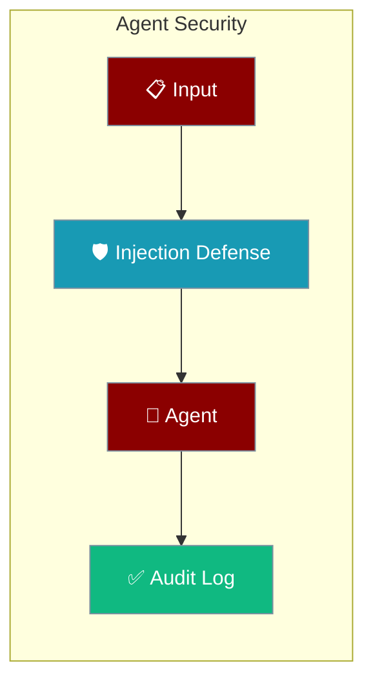
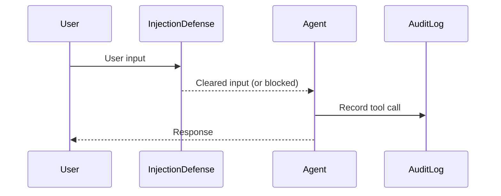

Harden an Agent by enabling security defaults before it runs — injection defense, audit logging, and sandboxed execution.

```python
from praisonaiagents import Agent
from praisonai.security import enable_security

enable_security()  # Injection defense + audit logging
agent = Agent(instructions="Help users safely")
agent.start("Summarise this document")
```



# Security

<Note>
PraisonAI takes security seriously. This page outlines our security policies, how to report vulnerabilities, and best practices for secure deployment.
</Note>

## Supported Versions

<CardGroup cols={2}>
  <Card title="Latest (>= 2.0.0)" icon="check-circle" color="#22c55e">
    Actively maintained with security patches
  </Card>
  <Card title="Legacy (< 2.0.0)" icon="x-circle" color="#ef4444">
    Please upgrade to the latest version
  </Card>
</CardGroup>

## Reporting Security Vulnerabilities

If you discover a security vulnerability, please report it responsibly to help protect the community.

<Tip>
**GitHub Security Advisories** is the preferred reporting method for fastest response.
</Tip>

<Steps>
  <Step title="Open Draft Advisory">
    Navigate to [github.com/MervinPraison/PraisonAI/security/advisories/new](https://github.com/MervinPraison/PraisonAI/security/advisories/new)
  </Step>
  <Step title="Describe the Issue">
    Include detailed reproduction steps and impact assessment
  </Step>
  <Step title="Allow Time for Fix">
    Allow time for maintainers to address the issue before public disclosure
  </Step>
</Steps>

### What to Include

<AccordionGroup>
  <Accordion title="Vulnerability Description" icon="file-lines">
    Clear explanation of the security issue and affected components
  </Accordion>
  <Accordion title="Reproduction Steps" icon="play">
    Step-by-step instructions to reproduce the vulnerability
  </Accordion>
  <Accordion title="Affected Versions" icon="code-branch">
    Which versions of PraisonAI are impacted
  </Accordion>
  <Accordion title="Impact Assessment" icon="gauge">
    Severity rating and potential consequences
  </Accordion>
  <Accordion title="Suggested Fix" icon="wrench">
    Optional: Your recommendation for fixing the issue
  </Accordion>
</AccordionGroup>

## Security Advisories

View all published security advisories:

<CardGroup cols={2}>
  <Card title="View Advisories" icon="shield" href="https://github.com/MervinPraison/PraisonAI/security/advisories">
    Browse all published security advisories on GitHub
  </Card>
  <Card title="Report New Issue" icon="plus" href="https://github.com/MervinPraison/PraisonAI/security/advisories/new">
    Create a new draft security advisory
  </Card>
</CardGroup>

### Recent Security Hardening (PR #2062)

<Warning>
**Breaking API change:** `enable_injection_defense()` now returns `Dict[str, str]` with keys `"before_tool"` and `"before_agent"` — not a single string hook ID.
</Warning>

```python
# Before (PR #2062)
hook_id = enable_injection_defense()
remove_hook("before_tool", hook_id)

# After (PR #2062)
hook_ids = enable_injection_defense()
remove_hook("before_tool", hook_ids["before_tool"])
remove_hook("before_agent", hook_ids["before_agent"])
```

Also in PR #2062:
- `execute_command` blocks `DANGEROUS_COMMANDS` by default (`allow_dangerous=False`)
- `search_replace` and `append_to_file` enforce protected paths
- Audit log is thread-safe with `get_audit_log().close()` lifecycle API
- AgentOps init deduplicated — use `is_agentops_available()` instead of eager `AGENTOPS_AVAILABLE` in `observability/hooks`

### Recent Security Hardening (PraisonAI #3087)

[Commit `d1d0272`](https://github.com/MervinPraison/PraisonAI/commit/d1d0272ee0d930ceb2619315d1636c50fb4ceef4) (fixes [#3087](https://github.com/MervinPraison/PraisonAI/issues/3087)) closes a workspace-escape bug in the code-editing tools.

**What changed:**
- `apply_diff`, `search_replace`, and `append_to_file` in `praisonai.code.tools` previously gated their workspace-confinement check behind `if workspace:` and silently skipped it when no workspace was passed.
- All three now default the workspace to `os.getcwd()` when unset, and always enforce `is_path_within_directory(...)` — matching the behaviour `write_file` / `read_file` already had.

**Who is affected:**
Anyone using `praisonai.code` tools (`code_apply_diff`, `code_search_replace`, `code_write_file`, or the low-level `append_to_file`) **without** calling `set_workspace(...)`. Absolute paths outside `cwd` are now rejected with `"Path '<path>' is outside the workspace"`.

**Action required:**
Either call `set_workspace("/intended/root")` before invoking the tools, or ensure the process `cwd` is the intended workspace root. No action needed if you were already calling `set_workspace(...)`.

<Warning>
Any workflow that never called `set_workspace()` and passed an absolute path outside `cwd` to `code_apply_diff` / `code_search_replace` / `append_to_file` will now fail. Set the workspace at the intended root instead.
</Warning>

See [Code Editing → Workspace Security](/code/editing#workspace-security) and [Protected Paths](/features/protected-paths).

## Recent Security Hardening (4.6.34)

PraisonAI **4.6.34** (released May 3, 2026) introduced three critical security fixes that change default behavior:

### Security Vulnerabilities Fixed

<CardGroup cols={3}>
  <Card title="GHSA-9mqq-jqxf-grvw" icon="shield-x" color="#dc2626" href="https://github.com/advisories/GHSA-9mqq-jqxf-grvw">
    **Critical**: Path traversal in MCP rules
  </Card>
  <Card title="GHSA-6rmh-7xcm-cpxj" icon="shield-alert" color="#ea580c" href="https://github.com/advisories/GHSA-6rmh-7xcm-cpxj">
    **High**: Unauthenticated API by default
  </Card>
  <Card title="GHSA-3643-7v76-5cj2" icon="shield-alert" color="#ca8a04" href="https://github.com/advisories/GHSA-3643-7v76-5cj2">
    **Medium**: SQL identifier injection
  </Card>
</CardGroup>

### Breaking Changes

<Warning>
If you're upgrading from **4.6.33 or earlier**, your setup may break. See the migration guide below.
</Warning>

**What changed:**
1. **API servers now require authentication by default** - anonymous requests return `401`
2. **API servers bind to `127.0.0.1` by default** instead of `0.0.0.0`
3. **MCP rules tools reject unsafe file paths** - names like `"../../etc/passwd"` now fail
4. **Knowledge backends validate identifiers** - collection names must be `[A-Za-z0-9_]+`

## Recent Security Hardening (next release — Security Batch 10)

PraisonAI's upcoming release includes **10 security advisories** worth of hardening fixes from [PR #1684](https://github.com/MervinPraison/PraisonAI/pull/1684). Several changes are **user-facing and breaking**.

### Security Vulnerabilities Fixed

<CardGroup cols={3}>
  <Card title="GHSA-4mr5-g6f9-cfrh" icon="shield-x" color="#dc2626" href="https://github.com/advisories/GHSA-4mr5-g6f9-cfrh">
    **Critical**: execute_code sandbox escapes
  </Card>
  <Card title="GHSA-5c6w-wwfq-7qqm" icon="shield-alert" color="#ea580c" href="https://github.com/advisories/GHSA-5c6w-wwfq-7qqm">
    **High**: spider_tools loopback bypass
  </Card>
  <Card title="GHSA-9cr9-25q5-8prj" icon="shield-alert" color="#ea580c" href="https://github.com/advisories/GHSA-9cr9-25q5-8prj">
    **High**: MCP CLI tools path traversal
  </Card>
  <Card title="GHSA-86qc-r5v2-v6x6" icon="shield-alert" color="#ea580c" href="https://github.com/advisories/GHSA-86qc-r5v2-v6x6">
    **High**: Call server unauthenticated
  </Card>
  <Card title="GHSA-hvhp-v2gc-268q" icon="shield-alert" color="#ca8a04" href="https://github.com/advisories/GHSA-hvhp-v2gc-268q">
    **Medium**: write_file workspace escape
  </Card>
  <Card title="GHSA-5cxw-77wg-jrf3" icon="shield-alert" color="#ca8a04" href="https://github.com/advisories/GHSA-5cxw-77wg-jrf3">
    **Medium**: @url: mentions SSRF
  </Card>
  <Card title="GHSA-xwq8-frcg-77q8" icon="shield-check" color="#16a34a" href="https://github.com/advisories/GHSA-xwq8-frcg-77q8">
    **Low**: Cross-workspace IDOR
  </Card>
  <Card title="GHSA-c2m8-4gcg-v22g" icon="shield-check" color="#16a34a" href="https://github.com/advisories/GHSA-c2m8-4gcg-v22g">
    **Low**: Platform RBAC bypass
  </Card>
  <Card title="GHSA-xp85-6wwf-r67c" icon="shield-check" color="#16a34a" href="https://github.com/advisories/GHSA-xp85-6wwf-r67c">
    **Low**: CI branch injection
  </Card>
  <Card title="GHSA-3qg8-5g3r-79v5" icon="shield-check" color="#16a34a" href="https://github.com/advisories/GHSA-3qg8-5g3r-79v5">
    **Low**: Platform default JWT secret
  </Card>
</CardGroup>

### Breaking Changes

<Warning>
**Four breaking changes** require configuration updates before upgrading:

1. **`praisonai call` now requires `CALL_SERVER_TOKEN`** (or explicit opt-out) — server fails with 503 if unconfigured
2. **MCP `workflow_show` / `workflow_validate` / `deploy_validate` no longer accept absolute or outside-cwd paths** — place files in project root
3. **Platform member/workspace mutation endpoints now enforce `admin` / `owner` roles** — grant appropriate roles to existing clients
4. **Platform refuses to issue JWTs when running with the default secret outside `PLATFORM_ENV=dev`** — set `PLATFORM_JWT_SECRET` in production
</Warning>

**Call server bind hardening ([PR #2085](https://github.com/MervinPraison/PraisonAI/pull/2085), fixes [#1602](https://github.com/MervinPraison/PraisonAI/issues/1602)):** `praisonai call` now binds to `127.0.0.1` by default and exposes a `--host` flag for explicit override. Previously bound to `0.0.0.0` unconditionally while printing a misleading `http://localhost:{port}` log line. If `--host 0.0.0.0` is used without `--public`, a `WARNING` is printed at startup. Related advisory: [GHSA-86qc-r5v2-v6x6](https://github.com/advisories/GHSA-86qc-r5v2-v6x6).

### Migration for API Server Users

For step-by-step migration instructions, see [API Server Authentication](/features/api-server-auth#migration-from--4634).

## Recent Security Hardening (Batch 2)

PraisonAI **Security Batch 2** (merged May 19, 2026) introduces six additional critical security fixes with behavioral changes:

### Security Vulnerabilities Fixed

<CardGroup cols={3}>
  <Card title="GHSA-943m-6wx2-rc2j" icon="shield-x" color="#dc2626" href="https://github.com/advisories/GHSA-943m-6wx2-rc2j">
    **High**: Platform cross-workspace project access
  </Card>
  <Card title="GHSA-5jx9-w35f-vp65" icon="shield-alert" color="#ea580c" href="https://github.com/advisories/GHSA-5jx9-w35f-vp65">
    **High**: Platform cross-workspace label access
  </Card>
  <Card title="GHSA-4x6r-9v57-3gqw" icon="shield-alert" color="#ca8a04" href="https://github.com/advisories/GHSA-4x6r-9v57-3gqw">
    **Medium**: Platform cross-workspace dependencies
  </Card>
  <Card title="GHSA-27p4-pjqv-whgj" icon="shield-alert" color="#ca8a04" href="https://github.com/advisories/GHSA-27p4-pjqv-whgj">
    **Medium**: Platform cross-workspace activity logs
  </Card>
  <Card title="GHSA-6xj3-927j-6pqw" icon="shield-check" color="#10b981" href="https://github.com/advisories/GHSA-6xj3-927j-6pqw">
    **Medium**: Deploy HTML sanitization missing
  </Card>
  <Card title="GHSA-vg22-4gmj-prxw" icon="shield-check" color="#6366f1" href="https://github.com/advisories/GHSA-vg22-4gmj-prxw">
    **Low**: Tool eval() RCE in examples
  </Card>
</CardGroup>

### Breaking / Behavioral Changes

<Warning>
If you're using platform APIs or custom tool examples, your setup may require updates.
</Warning>

**What changed:**
1. **Cross-workspace IDs on platform routes now return 404** instead of leaking data - affects project, label, dependency, and issue-activity routes
2. **Generated `api.py` from `praisonai deploy` now requires the `bleach` package** at runtime for HTML sanitization
3. **Custom tool eval examples switched from `eval` to AST allow-list** - if you copied the old `_safe_eval` snippet, adopt the new pattern (see [Safe Tool Eval](/features/custom-tool-safe-eval))
4. **`WorkspaceService.delete` now also removes `Member` rows** in the same transaction - no caller action needed but SDK consumers relying on orphaned memberships should re-check fixtures

### Hardened Examples

The unsafe `eval(expr, {"__builtins__": {}})` pattern in examples has been replaced with an AST-based allow-list that only permits basic arithmetic operations. See the new [Safe Math Eval in Custom Tools](/features/custom-tool-safe-eval) guide for the secure implementation pattern.

## Recent Security Hardening (PR #1870)

[PR #1870](https://github.com/MervinPraison/PraisonAI/pull/1870) adds
filesystem-boundary enforcement to the local sandbox backends.

### What changed
- `DockerSandbox.write_file / read_file / list_files` and
  `SubprocessSandbox.write_file / read_file / list_files` now reject
  any path that resolves outside the sandbox's `temp_dir`.
- Rejected operations return `False` (write), `None` (read), or `[]` (list)
  and log `Path traversal attempt blocked: <path>`.
- Helper: `praisonai.sandbox._compat.safe_sandbox_path()`.

### Who is affected
Anyone using `sandbox=True`, `sandbox=SandboxConfig.docker(...)`,
or `sandbox=SandboxConfig.subprocess(...)` and exposing
`execute_python_code` / `execute_shell_command` tools to an LLM.

### Action required
None — the protection is on by default. If an agent had previously
relied on writing to host paths via `../`, it will now fail and should
be reconfigured to write inside the sandbox root.

## How It Works

Every input passes through injection defense before the Agent acts, and every tool call is recorded in the audit log.



<Warning>
**Hook inputs are always scanned as external.** The injection defense treats every string reaching the `before_llm_call` hook (system prompt, user prompt, prompt list) as untrusted, regardless of any `_source` attribute on the payload. Trust cannot be re-declared inside the hook payload — a compromised tool wrapper or mis-wired middleware cannot silently disable scanning by setting `data._source = "internal"`.
</Warning>

## Best Practices

### Webhook Verification

Bot adapters that accept inbound webhooks verify HMAC signatures **fail-closed** by default — missing secrets or invalid signatures return HTTP 401. Set `PRAISONAI_INSECURE_WEBHOOKS=true` only for local development. See [Webhook Verification](/docs/features/webhook-verification).

<Tabs>
  <Tab title="API Key Management">
    <Note>
      Never hardcode API keys in your source code. Use environment variables instead.
    </Note>
    
    ```python
    import os
    from praisonaiagents import Agent

    agent = Agent(
        api_key=os.environ.get("OPENAI_API_KEY"),
        # ... other config
    )
    ```
  </Tab>
  <Tab title="Sandboxed Execution">
    <Tip>
      Always use sandbox mode when enabling code execution in agents.
    </Tip>
    
    ```python
    from praisonaiagents import Agent
    from praisonaiagents.agent.config import ExecutionConfig

    agent = Agent(
        execution=ExecutionConfig(
            code_execution=True,
            code_mode="safe"  # Sandboxed execution
        )
    )
    ```
  </Tab>
  <Tab title="Input Validation">
    <Note>
      Validate and sanitize user inputs before passing to agents.
    </Note>
    
    ```python
    from praisonaiagents.security import scan_text

    result = scan_text(user_input)
    if result.threat_level.value >= 3:  # HIGH or CRITICAL
        raise ValueError("Potentially malicious input detected")
    ```
  </Tab>
</Tabs>

## How to Secure Your Agents

### Secure Agent Configuration

<Steps>
  <Step title="Enable Security Modules">
    Always enable security features before creating agents:
    ```python
    from praisonai.security import enable_security
    enable_security()  # Enables injection defense + audit logging
    ```
  </Step>
  <Step title="Set Workspace Boundaries">
    Define clear workspace boundaries to prevent path traversal:
    ```python
    from praisonai.code import set_workspace
    set_workspace("/safe/project/directory")  # Agents cannot escape this
    ```
  </Step>
  <Step title="Use ExecutionConfig for Code">
    When agents need to execute code, always use safe mode:
    ```python
    from praisonaiagents.agent.config import ExecutionConfig
    
    execution = ExecutionConfig(
        code_execution=True,
        code_mode="safe",  # Sandboxed, not "unsafe"
        timeout=30  # Limit execution time
    )
    ```

    When using [Code Mode Tool Bridge](/features/code-execution-with-tools), `require_approval` is honoured on **every** tool call from within the script — a single approval does not silently unlock later calls. The feature is opt-in via `code_tools=True` and requires an explicit `code_tools_allow` list:
    ```python
    execution = ExecutionConfig(
        code_execution=True,
        code_tools=True,
        code_tools_allow=["fetch", "extract_price"],  # Only these tools are callable
    )
    ```
  </Step>
  <Step title="Configure Rate Limiting">
    Prevent abuse with rate limiting:
    ```python
    from praisonaiagents.agent.config import ExecutionConfig
    from praisonaiagents.config import RateLimiter
    
    rate_limiter = RateLimiter(
        max_calls=100,
        per_seconds=60
    )
    execution = ExecutionConfig(rate_limiter=rate_limiter)
    ```
  </Step>
  <Step title="Add Verification Hooks">
    For autonomous agents, add verification hooks:
    ```python
    from praisonaiagents.agent.autonomy import AutonomyConfig
    
    autonomy = AutonomyConfig(
        verification_hooks=[my_custom_validator],
        max_iterations=10  # Prevent infinite loops
    )
    ```
  </Step>
</Steps>

### Security Checklist

<AccordionGroup>
  <Accordion title="Pre-Deployment Checklist" icon="clipboard-check">
    - [ ] Security modules enabled (`enable_security()`)
    - [ ] Workspace boundaries set
    - [ ] API keys in environment variables (not hardcoded)
    - [ ] Code execution in "safe" mode (if enabled)
    - [ ] Rate limiting configured
    - [ ] Protected paths reviewed
    - [ ] Input validation enabled
  </Accordion>
  <Accordion title="Runtime Security Checklist" icon="play-circle">
    - [ ] Audit logging active
    - [ ] Injection defense scanning all inputs
    - [ ] Path traversal protection enabled
    - [ ] Tool execution timeout set
    - [ ] Memory limits configured
    - [ ] Error handling doesn't leak sensitive info
  </Accordion>
  <Accordion title="Production Hardening" icon="server">
    - [ ] Network egress restricted
    - [ ] Container sandboxing enabled
    - [ ] Secrets management (Vault/AWS Secrets/etc.)
    - [ ] Log aggregation configured
    - [ ] Monitoring and alerting active
    - [ ] Regular dependency updates
    - [ ] Security scanning in CI/CD
  </Accordion>
</AccordionGroup>

### FileMemory `user_id` sanitisation

`FileMemory(user_id=...)` strips whitespace, rejects path-traversal characters, and uses the sanitised value for both the in-memory `user_id` and the on-disk `user_path`. Empty or whitespace-only inputs fall back to `"default"`. Fix landed in [PR #1980](https://github.com/MervinPraison/PraisonAI/pull/1980) — earlier releases used the raw input for the path, so `user_id="  alice  "` could write to a different directory than `mem.user_id` reported.

## Secure Implementation Guide

### Pattern 1: Secure Multi-Agent Workflow

<Note>
This pattern shows how to configure multiple agents securely with proper isolation and monitoring.
</Note>

```python
from praisonaiagents import Agent, AgentTeam
from praisonaiagents.agent.config import ExecutionConfig
from praisonaiagents import MemoryConfig
from praisonai.security import enable_security, enable_injection_defense

# Step 1: Enable security globally
enable_security()

# Step 2: Create secure execution config
secure_execution = ExecutionConfig(
    code_execution=True,
    code_mode="safe",
    timeout=30,
    rate_limiter=RateLimiter(max_calls=50, per_seconds=60)
)

# Step 3: Configure memory with auto-save
secure_memory = MemoryConfig(
    auto_save="session_name",  # Persist securely
    history=True  # Track for audit
)

# Step 4: Create agents with security config
researcher = Agent(
    name="researcher",
    instructions="Research topics safely",
    execution=secure_execution,
    memory=secure_memory,
    tools=["search_web"]  # Whitelist allowed tools
)

writer = Agent(
    name="writer",
    instructions="Write content based on research",
    execution=secure_execution,
    memory=secure_memory
)

# Step 5: Create team with handoff security
team = AgentTeam(
    agents=[researcher, writer],
    handoffs={"researcher": [writer]},  # Explicit handoff allowed
    process="sequential"  # Controlled flow
)

team.start("Research and write about AI safety")
```

### Pattern 2: Secure Bot Deployment

```python
from praisonai import AgentOS
from praisonai.bots import BotConfig
from praisonai.security import enable_security

# Enable security before any bot operations
enable_security()

# Configure bot with security defaults
config = BotConfig(
    auto_approve_tools=False,  # Require approval for tool calls
    allowed_tools=["search_web", "schedule_add"],  # Bot-level whitelist (runtime)
    max_messages_per_minute=30,  # Rate limiting
    session_timeout=3600  # 1 hour session limit
)

# Note: BotConfig.allowed_tools provides per-bot runtime filtering
# For global environment-level tool whitelisting, use ALLOWED_TOOLS env var
# See: /features/allowed-tools for comprehensive collision prevention

# Deploy with platform-specific security
botos = AgentOS.from_config("botos.yaml")
botos.run()
```

### Pattern 3: Secure Autonomous Agent

<Warning>
Autonomous agents require extra security measures. Always use verification hooks and iteration limits.
</Warning>

```python
from praisonaiagents import Agent
from praisonaiagents.agent.autonomy import AutonomyConfig, AutonomyLevel
from praisonaiagents.agent.config import ExecutionConfig

# Strict execution limits
execution = ExecutionConfig(
    code_execution=True,
    code_mode="safe",
    timeout=10  # Short timeout for autonomous actions
)

# Autonomy with guardrails
autonomy = AutonomyConfig(
    level=AutonomyLevel.SUGGEST,  # Start conservative
    auto_escalate=False,  # Manual approval for escalation
    max_iterations=5,  # Prevent runaway loops
    verification_hooks=[
        lambda action: validate_action_safe(action),
        lambda action: check_resource_limits(action)
    ]
)

agent = Agent(
    name="autonomous_assistant",
    instructions="Help users autonomously within strict bounds",
    execution=execution,
    autonomy=autonomy,
    tools=["read_file", "write_file"]  # Limited toolset
)

# Run with explicit user approval loop
agent.run_autonomous(
    prompt="Organize my project files",
    require_approval=True  # Each action needs approval
)
```

### Pattern 4: Secure MCP Server Integration

```python
from praisonaiagents import Agent
from praisonaiagents.mcp import MCP

# Whitelist only specific MCP servers
allowed_mcp_servers = [
    MCP(
        command="npx",
        args=["-y", "@modelcontextprotocol/server-filesystem"],
        env={"ALLOWED_PATHS": "/safe/data"}  # Restrict server access
    )
]

agent = Agent(
    name="mcp_agent",
    instructions="Use filesystem tools safely",
    tools=allowed_mcp_servers,
    execution=ExecutionConfig(
        code_execution=False  # Disable code exec when using MCP
    )
)
```

## Security Hardening by Environment

<Tabs>
  <Tab title="Development">
    <CardGroup cols={2}>
      <Card title="Enable All Logging" icon="terminal">
        Set LOGLEVEL=debug for security event visibility
      </Card>
      <Card title="Use Test API Keys" icon="key">
        Separate keys with limited quotas for dev
      </Card>
    </CardGroup>
    
    ```python
    import os
    os.environ["LOGLEVEL"] = "debug"
    from praisonai.security import enable_security
    enable_security()
    ```
  </Tab>
  <Tab title="Staging">
    <CardGroup cols={2}>
      <Card title="Audit Mode" icon="eye">
        Enable full audit logging without blocking
      </Card>
      <Card title="Test Protection" icon="vial">
        Verify all security controls work
      </Card>
    </CardGroup>
    
    ```python
    from praisonai.security import enable_audit_log
    enable_audit_log()
    ```
  </Tab>
  <Tab title="Production">
    <CardGroup cols={2}>
      <Card title="Block Mode" icon="shield">
        Enable blocking for all threat levels
      </Card>
      <Card title="Minimal Logs" icon="file-minus">
        Reduce verbose logging, keep audit trail
      </Card>
    </CardGroup>
    
    ```python
    from praisonai.security import enable_security
    from praisonaiagents.security import InjectionDefense
    
    # Production: block on medium+ threats
    defense = InjectionDefense(blocking_threshold="MEDIUM")
    enable_security(defense)
    ```
  </Tab>
</Tabs>

## CVE Policy

PraisonAI follows responsible disclosure practices with a structured workflow:


<Tip>
This process typically takes **1-3 business days** from report to CVE assignment.
</Tip>

## Security Features

<CardGroup cols={2}>
  <Card title="Path Traversal Protection" icon="folder-tree" color="#189AB4">
    Prevents agents from accessing files outside the designated workspace
  </Card>
  <Card title="Injection Defense" icon="shield-virus" color="#8B0000">
    Scans for prompt injection attempts before processing
  </Card>
  <Card title="Protected Paths" icon="lock" color="#f59e0b" href="/docs/features/protected-paths">
    Blocks modification of sensitive system files and directories
  </Card>
  <Card title="Audit Logging" icon="clipboard-list" color="#22c55e" href="/docs/features/audit-logging">
    Thread-safe JSONL audit log for tool calls
  </Card>
</CardGroup>

### Optional Security Modules

```python
from praisonai.security import enable_security, enable_injection_defense

# Enable all security features
enable_security()

# Or enable specific features
enable_injection_defense()
```

## Secrets in Deployment

PraisonAI never passes secrets via command line arguments, which prevents exposure in process lists, shell history, and CI logs.

### Secure Cloud Deployment

When deploying to cloud platforms, PraisonAI automatically handles secrets securely:

```python
from praisonai.deploy import Deploy, DeployConfig, DeployType, CloudProvider

config = DeployConfig(
    type=DeployType.CLOUD,
    cloud=CloudConfig(
        provider=CloudProvider.GCP,
        # Secrets are handled via secure temp files, not argv
        env_vars={
            "OPENAI_API_KEY": os.getenv("OPENAI_API_KEY"),
            "DATABASE_URL": os.getenv("DATABASE_URL")
        }
    )
)

deploy = Deploy(config, "agents.yaml")
result = deploy.deploy()  # Uses --env-vars-file with chmod 0600
```

The deployment process:
1. Creates temp YAML via `tempfile.mkstemp()` with mode `0600` (owner read/write only)
2. Writes secrets to temp file instead of command line
3. Passes via `--env-vars-file` to `gcloud` command
4. Removes temp file in `finally` block, even if deployment fails

**Reference:** See [GCP Deploy Documentation](/docs/deploy/cli/gcp) for implementation details.

### Gateway Edge Protections (PR #2623)

Internet-exposed `praisonai serve gateway` deployments now have two default-on guards that require no configuration:

- **`PreauthConnectionBudget`** — caps concurrent unauthenticated WebSocket connections per source IP (`preauth_max_connections_per_ip=32`). Connections that exceed the cap are closed before auth runs with WebSocket close code `4029`. Loopback is always exempt.
- **`UnauthorizedFloodGuard`** — closes a connection that sends too many unauthorized frames on a single session (`max_unauthorized_frames=10`), using close code `4028`. Distinct from the existing `4008` handshake rate-limit code so clients can handle each case correctly.
- **`AuthRateLimiter` overflow fail-closed** — when the per-IP key map is saturated, new IPs are rejected rather than admitted (which would evict existing lockouts). Existing lockouts are preserved even under a fresh-IP flood.

<Card title="Gateway Edge Protections" icon="shield-halved" href="/docs/features/gateway-edge-protections">
  Full operator guide: defaults, YAML/Python tuning, close code reference, and when to change limits
</Card>

### Recent Security Hardening (PR #2850)

[PR #2850](https://github.com/MervinPraison/PraisonAI/pull/2850) (fixes [#2843](https://github.com/MervinPraison/PraisonAI/issues/2843)) upgrades `.gateway_secret` handling in `praisonai_bot.gateway.pairing` from warn-only to **remediate-or-fail-closed**. The file signs pairing codes, so world-readable permissions previously allowed forged codes; the old behaviour surfaced the risk but loaded the file anyway.

Permissions are now re-checked and remediated on **every** `PairingStore(...)` construction, not only at creation:

- **POSIX**: an existing file with any mode other than `0o600` is `chmod`-ed to `0o600` on load. A failing `chmod` raises `OSError` instead of falling back to secret regeneration — preserving the HMAC signing key so outstanding pairing codes stay valid.
- **Windows**: best-effort ACL lockdown via `icacls /inheritance:r /grant:r "<user>":F`, with `icacls` resolved from `%SystemRoot%\System32` rather than `PATH` to avoid a hijacked binary. This path is best-effort and **never raises**.
- The prior per-init `WARNING` (`"Gateway secret file … has insecure permissions …"`) is removed; POSIX success logs at `INFO`, and Windows logs at `DEBUG` only.

See [Bot Pairing → Secret Management](/docs/features/bot-pairing#secret-management).

### Recent Security Hardening

Recent security improvements include:

**Gateway Auth Token Unification (PR #1744):**
- Config token now exports to `GATEWAY_AUTH_TOKEN` env var at startup
- Ensures all auth paths (HTTP, magic-link, WebSocket) use the same secret
- Config wins over environment variable to prevent stale token issues

**Sandbox Resource Cleanup (PR #1744):**
- SSH: Fixed temp file cleanup in `finally` block and remote process timeout handling
- Docker: Container naming and proper kill on timeout to enforce resource limits
- Prevents resource leaks that could lead to DoS conditions

**Cloud Deploy Secret Handling (PR #1744):**
- Uses secure temp YAML file with `chmod 0600` instead of argv secrets
- Prevents secret exposure in `ps`, shell history, and CI logs
- Automatic cleanup even on deployment failures

## Concurrency & Async Safety

PraisonAI includes several security hardening measures for concurrent and asynchronous execution:

### Chat-History Integrity

Chat history mutations are now lock-protected to prevent lost updates and corrupt rollback in multi-agent and async scenarios:

```python
# Safe concurrent access to chat history
agent.chat_history = new_messages  # Uses locked setter
response = agent.chat("Hello")     # Thread-safe appending
```

### Fail-Closed Approvals

Console-backend approvals now raise `PermissionError` in async contexts instead of silently bypassing security checks:

```python
# Configure non-console backend for async compatibility
from praisonaiagents.approval import get_approval_registry, WebhookBackend

get_approval_registry().set_backend(
    WebhookBackend(url="https://your-approval-service.com/approve")
)
```

See the [Approval](/features/approval) guide for more async-compatible backends.

### Visible Failures

Previously silent failures now log at WARN level with stack traces for improved security visibility:

- Streaming callback errors (`praisonaiagents.streaming.events`)
- Session-gateway linkage failures (`praisonaiagents.agent.execution_mixin`)
- Learning-nudge generation failures (`praisonaiagents.agent.tool_execution`)

Monitor these log channels for potential security incidents or system anomalies.

## Resources

<CardGroup cols={2}>
  <Card title="GitHub Repository" icon="github" href="https://github.com/MervinPraison/PraisonAI">
    Source code, issue tracking, and contribution guidelines
  </Card>
  <Card title="Documentation" icon="book" href="https://praison.ai/docs">
    Comprehensive guides, API reference, and tutorials
  </Card>
  <Card title="Website" icon="globe" href="https://praison.ai">
    Product overview, features, and enterprise solutions
  </Card>
  <Card title="Security Advisories" icon="shield-halved" href="https://github.com/MervinPraison/PraisonAI/security">
    View and report security issues
  </Card>
</CardGroup>

## Acknowledgments

We thank the security researchers who have responsibly disclosed vulnerabilities. Credits are listed in individual security advisories on [GitHub](https://github.com/MervinPraison/PraisonAI/security/advisories).

<Note>
**Thank you** to all security researchers who help make PraisonAI safer for everyone.
</Note>

## Related

<CardGroup cols={2}>
  <Card title="Protected Paths" icon="lock" href="/docs/features/protected-paths">
    Block modification of sensitive files and directories.
  </Card>
  <Card title="Audit Logging" icon="clipboard-list" href="/docs/features/audit-logging">
    Thread-safe JSONL audit log for tool calls.
  </Card>
</CardGroup>
