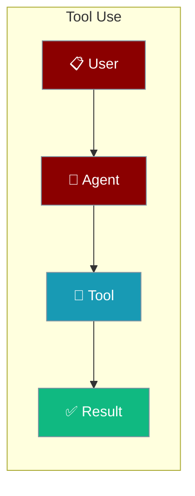
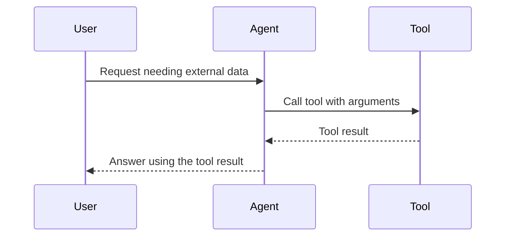

Give an Agent a tool and it can search, fetch, and act — pass any Python function or built-in tool through `tools=[...]`.

```python
from praisonaiagents import Agent
from praisonaiagents.tools import duckduckgo

agent = Agent(instructions="Research AI news", tools=[duckduckgo])
agent.start("Find the latest AI news today")
```



## Quick Start

<Steps>
<Step title="Write a tool function">
A tool is any typed Python function with a docstring:

```python
from typing import List, Dict

def internet_search_tool(query: str) -> List[Dict]:
    """Search the internet for the given query."""
    from duckduckgo_search import DDGS
    return [
        {"title": r.get("title", ""), "url": r.get("href", ""), "snippet": r.get("body", "")}
        for r in DDGS().text(keywords=query, max_results=5)
    ]
```
</Step>

<Step title="Give it to an Agent">
```python
from praisonaiagents import Agent

agent = Agent(instructions="Research assistant", tools=[internet_search_tool])
agent.start("AI job trends in 2024")
```
</Step>
</Steps>

<div className="relative w-full aspect-video">
  <iframe
    className="absolute top-0 left-0 w-full h-full"
    src="https://www.youtube.com/embed/XaQRgRpV7jo"
    title="YouTube video player"
    allow="accelerometer; autoplay; clipboard-write; encrypted-media; gyroscope; picture-in-picture"
    allowFullScreen
  ></iframe>
</div>

## Inbuild Tools

- CodeDocsSearchTool
- CSVSearchTool
- DirectorySearchTool
- DirectoryReadTool
- DOCXSearchTool
- FileReadTool
- GithubSearchTool
- SerperDevTool
- TXTSearchTool
- JSONSearchTool
- MDXSearchTool
- PDFSearchTool
- PGSearchTool
- RagTool
- ScrapeElementFromWebsiteTool
- ScrapeWebsiteTool
- SeleniumScrapingTool
- WebsiteSearchTool
- XMLSearchTool
- YoutubeChannelSearchTool
- YoutubeVideoSearchTool

<Note>
Need parameter limits that change at runtime? See [Dynamic Tool Schemas](/features/dynamic-tool-schemas) to make your tools reflect current configuration.
</Note>

## Example Usage

```yaml
framework: crewai
topic: research about the causes of lung disease
agents:  # Canonical: use 'agents' instead of 'roles'
  research_analyst:
    instructions: Experienced in analyzing scientific data related to respiratory health.  # Canonical: use 'instructions' instead of 'backstory'
    goal: Analyze data on lung diseases
    role: Research Analyst
    tasks:
      data_analysis:
        description: Gather and analyze data on the causes and risk factors of lung diseases.
        expected_output: Report detailing key findings on lung disease causes.
    tools:
    - WebsiteSearchTool
```

## How It Works

The Agent decides when to call a tool, runs the function, and feeds the result back into the model to complete its answer.



## Best Practices

<AccordionGroup>
<Accordion title="Type your tool functions">
Add type hints and a one-line docstring to every tool. The Agent uses these to build the tool schema the model sees.
</Accordion>

<Accordion title="Keep tools focused">
Give each tool one clear job. Small, single-purpose tools are easier for the model to call correctly.
</Accordion>

<Accordion title="Prefer built-in tools first">
Import ready-made tools from `praisonaiagents.tools` before writing your own — for example `from praisonaiagents.tools import duckduckgo`.
</Accordion>

<Accordion title="Return simple, structured data">
Return lists of dicts or plain strings so the model can read the result. Avoid returning large objects or binary blobs.
</Accordion>
</AccordionGroup>

## Related

<CardGroup cols={2}>
  <Card title="Quick Start" icon="bolt" href="/docs/quickstart">
    Build your first agent with a tool.
  </Card>
  <Card title="Models" icon="brain" href="/docs/models">
    Choose the model that calls your tools.
  </Card>
</CardGroup>