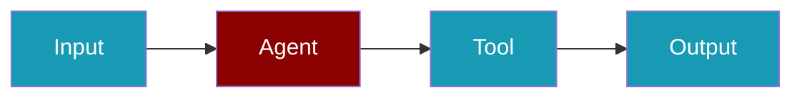

```python
from praisonaiagents import Agent

agent = Agent(
    name="GovernedAssistant",
    instructions="Follow audit, policy, and human-oversight requirements.",
)
agent.start("Review this agent module for compliance gaps")
```

The user opens a pull request; CI runs Asqav to scan PraisonAI imports for governance patterns before merge.



# Asqav Compliance Scanner

[Asqav Compliance](https://github.com/jagmarques/asqav-compliance) is a GitHub Action that scans Python files importing agent frameworks (including PraisonAI) and checks for five governance patterns on every PR.


## Quick Start

<Steps>
<Step title="Add the workflow file">
Create `.github/workflows/governance.yml` in your repo:

```yaml
name: Governance Check
on: [pull_request]
permissions:
  pull-requests: write
  contents: read
jobs:
  scan:
    runs-on: ubuntu-latest
    steps:
      - uses: actions/checkout@v4
      - uses: jagmarques/asqav-compliance@v1
        with:
          github-token: ${{ secrets.GITHUB_TOKEN }}
```
</Step>
<Step title="Open a pull request">
The scanner runs automatically on every PR and posts a compliance score as a PR comment.
</Step>
</Steps>


## What it checks

- **Audit Trail** - logging, signed actions, audit records
- **Policy Enforcement** - rate limits, scopes, permissions, guards
- **Revocation Capability** - kill switches, suspend, terminate, circuit breakers
- **Human Oversight** - approval flows, human-in-the-loop, confirmation gates
- **Error Handling** - try/except blocks around agent operations

## Setup

Add this to `.github/workflows/governance.yml` in your repo:

```yaml
name: Governance Check
on: [pull_request]
permissions:
  pull-requests: write
  contents: read
jobs:
  scan:
    runs-on: ubuntu-latest
    steps:
      - uses: actions/checkout@v4
      - uses: jagmarques/asqav-compliance@v1
        with:
          github-token: ${{ secrets.GITHUB_TOKEN }}
```

The action scans all Python files that import PraisonAI, LangChain, CrewAI, AutoGen, and other agent frameworks. It posts a compliance report as a PR comment with a score from 0 to 100.

## Configuration

| Input | Default | Description |
|-------|---------|-------------|
| `github-token` | required | GitHub token for posting PR comments |
| `scan-path` | `.` | Directory to scan |
| `fail-on-gaps` | `false` | Fail the CI check if governance gaps are found |

## Example output

The action posts a Markdown report on each PR showing which files have governance coverage and which have gaps. Files importing agent frameworks without audit trails or error handling are flagged.

## Links

- [GitHub Marketplace](https://github.com/marketplace/actions/ai-agent-governance-scanner)
- [Source Code](https://github.com/jagmarques/asqav-compliance)

## Best Practices

<AccordionGroup>
  <Accordion title="Enable fail-on-gaps in production">
    Set `fail-on-gaps: true` for production repos so governance gaps block merges rather than just warning.
  </Accordion>
  <Accordion title="Add error handling to every agent">
    Wrap `agent.start()` calls in try/except blocks to satisfy the Error Handling governance check.
  </Accordion>
  <Accordion title="Log agent actions">
    Use Python logging around agent operations to satisfy the Audit Trail check.
  </Accordion>
  <Accordion title="Review PR comments regularly">
    Asqav posts a compliance score on every PR - include it in your code review checklist.
  </Accordion>
</AccordionGroup>


## Related

<CardGroup cols={2}>
  <Card title="Custom Tools" icon="wrench" href="/docs/tools/custom">
    Build your own agent tools
  </Card>
  <Card title="Tools Overview" icon="toolbox" href="/docs/tools/tools">
    Browse PraisonAI tool documentation
  </Card>
</CardGroup>
