<Note>
  **Prerequisites**
  - Python 3.10 or higher
  - PraisonAI Agents package installed
  - ast-grep CLI (`pip install ast-grep-cli` or `npm install -g @ast-grep/cli`)
</Note>

## AST-Grep Tools

Use AST-Grep Tools to search, analyze, and rewrite code using structural patterns instead of regex.

<Tip>
Unlike regex, AST patterns understand code structure — they won't match patterns inside comments or strings. `$VAR` captures a single node, `$$$` captures multiple nodes.
</Tip>

<Steps>
  <Step title="Install Dependencies">
    Install PraisonAI Agents and ast-grep:
    ```bash
    pip install praisonaiagents
    pip install ast-grep-cli
    ```
  </Step>

  <Step title="Import Components">
    Import the AST-grep tools:
    ```python
    from praisonaiagents import Agent
    from praisonaiagents.tools import ast_grep_search, ast_grep_rewrite, ast_grep_scan
    ```
  </Step>

  <Step title="Create Agent">
    Create a code analysis agent:
    ```python
    agent = Agent(
        name="CodeAnalyzer",
        instructions="Analyze and refactor code using AST patterns.",
        tools=[ast_grep_search, ast_grep_rewrite, ast_grep_scan],
    )
    ```
  </Step>

  <Step title="Run Agent">
    Start the agent:
    ```python
    result = agent.start("Find all async function definitions in ./src")
    ```
  </Step>
</Steps>

## How It Works

```mermaid
flowchart LR
    subgraph Agent["Code Agent"]
        A[🤖 Agent]
    end

    subgraph Tools["AST-Grep Tools"]
        S[🔍 Search]
        R[✏️ Rewrite]
        SC[📋 Scan]
    end

    subgraph Code["Codebase"]
        F[Source Files]
    end

    A -->|"pattern + lang"| S
    A -->|"pattern + replacement"| R
    A -->|"rules YAML"| SC
    S --> F
    R --> F
    SC --> F

    style A fill:#8B0000,color:#fff
    style S fill:#189AB4,color:#fff
    style R fill:#189AB4,color:#fff
    style SC fill:#189AB4,color:#fff
    style F fill:#10B981,color:#fff
```



## Quick Start

<CodeGroup>
```python Search
from praisonaiagents import Agent
from praisonaiagents.tools import ast_grep_search

agent = Agent(
    name="CodeSearcher",
    instructions="Search code for structural patterns.",
    tools=[ast_grep_search],
)

result = agent.start("Find all function definitions in ./src")
```

```python Search + Rewrite
from praisonaiagents import Agent
from praisonaiagents.tools import ast_grep_search, ast_grep_rewrite

agent = Agent(
    name="Refactorer",
    instructions="Search and refactor code patterns.",
    tools=[ast_grep_search, ast_grep_rewrite],
)

result = agent.start("Rename all instances of 'old_function' to 'new_function' in Python files under ./src")
```

```python All Tools
from praisonaiagents import Agent
from praisonaiagents.tools import get_ast_grep_tools

agent = Agent(
    name="CodeReviewer",
    instructions="Review code quality using AST analysis.",
    tools=get_ast_grep_tools(),
)

result = agent.start("Scan ./src for anti-patterns and suggest refactoring")
```
</CodeGroup>

---

## Available Functions

```python
from praisonaiagents.tools import ast_grep_search
from praisonaiagents.tools import ast_grep_rewrite
from praisonaiagents.tools import ast_grep_scan
from praisonaiagents.tools import get_ast_grep_tools
from praisonaiagents.tools import is_ast_grep_available
```

## Function Details

### ast_grep_search(pattern, lang, path=".", json_output=True)

Searches code using AST patterns. Returns structured JSON results.

| Parameter | Type | Default | Description |
|---|---|---|---|
| `pattern` | `str` | required | AST pattern (`$VAR` = single node, `$$$` = multiple) |
| `lang` | `str` | required | Language: `python`, `javascript`, `typescript`, `rust`, `go`, `java`, `c`, `cpp` |
| `path` | `str` | `"."` | File or directory to search |
| `json_output` | `bool` | `True` | Return JSON format |

```python
# Find all Python function definitions
result = ast_grep_search("def $FN($$$)", lang="python", path="./src")

# Find all console.log calls in JavaScript
result = ast_grep_search("console.log($$$)", lang="javascript")

# Find all async functions
result = ast_grep_search("async def $FN($$$)", lang="python")

# Find all class definitions with inheritance
result = ast_grep_search("class $NAME($BASE):", lang="python")
```

### ast_grep_rewrite(pattern, replacement, lang, path=".", dry_run=True)

Rewrites code matching an AST pattern. **Dry-run by default** (shows changes without modifying files).

| Parameter | Type | Default | Description |
|---|---|---|---|
| `pattern` | `str` | required | AST pattern to match |
| `replacement` | `str` | required | Replacement pattern (can reference `$VAR` captures) |
| `lang` | `str` | required | Programming language |
| `path` | `str` | `"."` | File or directory |
| `dry_run` | `bool` | `True` | Preview only — set `False` to apply |

<Warning>
Setting `dry_run=False` will modify files in place. Always preview first with the default `dry_run=True`.
</Warning>

```python
# Preview: rename a function (dry run)
result = ast_grep_rewrite(
    "def old_name($$$)",
    "def new_name($$$)",
    lang="python",
    path="./src"
)

# Actually apply: replace console.log with logger.info
result = ast_grep_rewrite(
    "console.log($MSG)",
    "logger.info($MSG)",
    lang="javascript",
    dry_run=False
)
```

### ast_grep_scan(path=".", rule_file=None)

Scans code using YAML-based lint rules.

| Parameter | Type | Default | Description |
|---|---|---|---|
| `path` | `str` | `"."` | File or directory to scan |
| `rule_file` | `str` | `None` | Path to YAML rule file (uses `sgconfig.yml` if not set) |

```python
# Scan with default rules
result = ast_grep_scan(path="./src")

# Scan with custom rules
result = ast_grep_scan(path="./src", rule_file="./rules/security.yml")
```

---

## Autonomy Mode

AST-grep tools are automatically included when using autonomy mode:

```python
from praisonaiagents import Agent

# Tools auto-included via get_autonomy_default_tools()
agent = Agent(autonomy=True)
agent.start("Refactor the codebase to use consistent naming")
```

<Tip>
In autonomy mode, ast-grep tools are available without explicit `tools=` — the agent can use them whenever it decides to search or rewrite code.
</Tip>

---

## Graceful Fallback

AST-grep tools work safely even when ast-grep is **not installed**:

```python
from praisonaiagents.tools import is_ast_grep_available, ast_grep_search

# Check availability
if is_ast_grep_available():
    result = ast_grep_search("def $FN($$$)", lang="python")
else:
    print("ast-grep not installed")

# Or just call it — returns helpful install instructions
result = ast_grep_search("def $FN($$$)", lang="python")
# If not installed, returns:
# "ast-grep is not installed or not available in PATH.
#  To install: pip install ast-grep-cli"
```

<Info>
Agents with ast-grep tools will **never crash** if ast-grep is missing. The tools return install instructions instead.
</Info>

---

## Pattern Syntax

| Pattern | Meaning | Example |
|---|---|---|
| `$VAR` | Match single AST node | `def $FN()` matches any no-arg function |
| `$$$` | Match multiple nodes | `def $FN($$$)` matches any function |
| Literal code | Match exactly | `print("hello")` matches that exact call |

### Pattern Examples by Language

<AccordionGroup>
  <Accordion title="Python">
    ```python
    # All function definitions
    "def $FN($$$)"

    # All class definitions
    "class $NAME($$$):"

    # All if statements
    "if $COND: $$$"

    # All async functions
    "async def $FN($$$)"

    # All list comprehensions
    "[$EXPR for $VAR in $ITER]"
    ```
  </Accordion>

  <Accordion title="JavaScript / TypeScript">
    ```javascript
    // All arrow functions
    "($$$) => $BODY"

    // All console.log calls
    "console.log($$$)"

    // All async functions
    "async function $FN($$$) { $$$ }"

    // All React useState hooks
    "const [$STATE, $SETTER] = useState($$$)"

    // All fetch calls
    "fetch($URL, $$$)"
    ```
  </Accordion>

  <Accordion title="Rust">
    ```rust
    // All function definitions
    "fn $FN($$$) -> $RET { $$$ }"

    // All impl blocks
    "impl $TYPE { $$$ }"

    // All match expressions
    "match $EXPR { $$$ }"

    // All unsafe blocks
    "unsafe { $$$ }"
    ```
  </Accordion>
</AccordionGroup>

---

## Examples

<AccordionGroup>
<Accordion title="Security Audit Agent">
```python
from praisonaiagents import Agent, Task, AgentTeam
from praisonaiagents.tools import ast_grep_search, ast_grep_scan

security_agent = Agent(
    name="SecurityAuditor",
    instructions="""Audit code for security vulnerabilities:
    - Find eval() and exec() calls
    - Find SQL string concatenation
    - Find hardcoded credentials""",
    tools=[ast_grep_search, ast_grep_scan],
)

audit_task = Task(
    description="Audit ./src for security issues: eval/exec usage, SQL injection, hardcoded secrets.",
    expected_output="Security report with findings and recommendations.",
    agent=security_agent,
    name="security_audit"
)

team = AgentTeam(agents=[security_agent], tasks=[audit_task], process="sequential")
team.start()
```
</Accordion>

<Accordion title="Code Migration Agent">
```python
from praisonaiagents import Agent
from praisonaiagents.tools import ast_grep_search, ast_grep_rewrite

migrator = Agent(
    name="Migrator",
    instructions="""Migrate code patterns:
    - Replace deprecated APIs with new ones
    - Always preview first (dry_run=True)
    - Only apply changes after confirming the preview""",
    tools=[ast_grep_search, ast_grep_rewrite],
)

result = migrator.start(
    "Replace all console.log calls with logger.info in JavaScript files under ./app"
)
```
</Accordion>

<Accordion title="Multi-Agent Code Review">
```python
from praisonaiagents import Agent, Task, AgentTeam
from praisonaiagents.tools import ast_grep_search, ast_grep_scan

# Searcher finds patterns
searcher = Agent(
    name="PatternFinder",
    instructions="Find code patterns and anti-patterns using AST search.",
    tools=[ast_grep_search],
)

# Reviewer analyzes findings
reviewer = Agent(
    name="CodeReviewer",
    instructions="Review code quality findings and provide recommendations.",
)

search_task = Task(
    description="Find all functions longer than 50 lines and deeply nested conditionals.",
    agent=searcher,
    name="pattern_search"
)

review_task = Task(
    description="Review the search findings and provide refactoring recommendations.",
    agent=reviewer,
    name="code_review"
)

team = AgentTeam(
    agents=[searcher, reviewer],
    tasks=[search_task, review_task],
    process="sequential"
)
team.start()
```
</Accordion>
</AccordionGroup>

---

## Dependencies

| Package | Required | Install |
|---|---|---|
| `praisonaiagents` | Yes | `pip install praisonaiagents` |
| `ast-grep-cli` | Optional | `pip install ast-grep-cli` or `npm install -g @ast-grep/cli` |

<Info>
Install the optional autonomy extras for ast-grep + other autonomy tools:
```bash
pip install praisonaiagents[autonomy]
```
</Info>

## Error Handling

All functions include comprehensive error handling:
- **Not installed**: Returns helpful install instructions
- **Empty pattern**: Returns clear error message
- **Timeout**: 60s for search, 120s for rewrite/scan
- **Subprocess errors**: Captured and returned as strings
- **No matches**: Returns "No matches found" (not an error)

## Related

<CardGroup cols={2}>
  <Card title="Shell Tools" icon="terminal" href="/tools/shell_tools">
    Execute shell commands
  </Card>
  <Card title="Python Tools" icon="python" href="/tools/python_tools">
    Execute Python code
  </Card>
  <Card title="File Tools" icon="file" href="/tools/file_tools">
    File system operations
  </Card>
  <Card title="Security" icon="shield-halved" href="/best-practices/security">
    Security best practices
  </Card>
</CardGroup>
