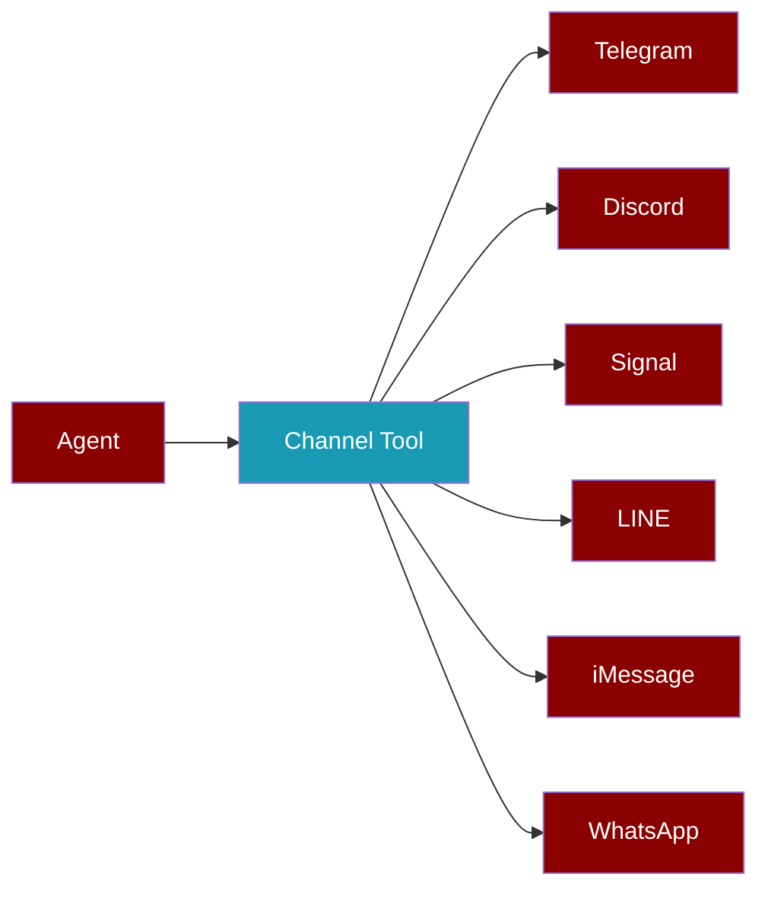

<Info>
PraisonAI supports **7+ messaging channels** including Telegram, Discord, Slack, Signal, LINE, iMessage, and WhatsApp.
</Info>



## Quick Start

<Tabs>
  <Tab title="Signal">
    ```python
    from praisonai_tools import SignalTool

    signal = SignalTool()
    signal.send_message(to="+1234567890", message="Hello!")
    ```
  </Tab>
  <Tab title="LINE">
    ```python
    from praisonai_tools import LineTool

    line = LineTool()
    line.push_message(to="user_id", message="Hello!")
    ```
  </Tab>
  <Tab title="iMessage">
    ```python
    from praisonai_tools import iMessageTool

    imsg = iMessageTool()
    imsg.send_message(to="+1234567890", message="Hello!")
    ```
  </Tab>
  <Tab title="WhatsApp">
    ```python
    from praisonai_tools import WhatsAppTool

    wa = WhatsAppTool()
    wa.send_message(to="+1234567890", message="Hello!")
    ```
  </Tab>
</Tabs>

## Installation

```bash
pip install praisonai-tools
```

---

## Signal

<Card title="Signal Tool" icon="signal-messenger">
Send messages via Signal using signal-cli REST API.
</Card>

### Setup

<Steps>
  <Step title="Install signal-cli REST API">
    Run the [signal-cli-rest-api](https://github.com/bbernhard/signal-cli-rest-api) Docker container:
    ```bash
    docker run -d --name signal-api -p 8080:8080 \
      -v signal-cli-config:/home/.local/share/signal-cli \
      bbernhard/signal-cli-rest-api
    ```
  </Step>
  <Step title="Link your device">
    Visit `http://localhost:8080/v1/qrcodelink?device_name=signal-api` to link your Signal account.
  </Step>
  <Step title="Set environment variables">
    ```bash
    export SIGNAL_CLI_URL=http://localhost:8080
    export SIGNAL_ACCOUNT=+1234567890
    ```
  </Step>
</Steps>

### Usage

<CodeGroup>
```python Basic
from praisonai_tools import SignalTool

signal = SignalTool()
result = signal.send_message(
    to="+1234567890",
    message="Hello from PraisonAI!"
)
```

```python With Agent
from praisonaiagents import Agent
from praisonai_tools import SignalTool

agent = Agent(
    name="Notifier",
    tools=[SignalTool()]
)
agent.start("Send a Signal message to +1234567890 saying hello")
```

```python Groups
from praisonai_tools import SignalTool

signal = SignalTool()

# Send to group
signal.send_message(
    to="group:abc123xyz",
    message="Hello group!"
)

# List groups
groups = signal.list_groups()
```
</CodeGroup>

### Actions

| Action | Description |
|--------|-------------|
| `send` | Send text message |
| `send_typing` | Send typing indicator |
| `send_receipt` | Send read receipt |
| `send_reaction` | React to a message |
| `check` | Check connection status |
| `list_groups` | List all groups |

---

## LINE

<Card title="LINE Tool" icon="line">
Send messages via LINE Messaging API.
</Card>

### Setup

<Steps>
  <Step title="Create LINE Channel">
    Go to [LINE Developers Console](https://developers.line.biz/) and create a Messaging API channel.
  </Step>
  <Step title="Get credentials">
    Copy your **Channel access token** and **Channel secret**.
  </Step>
  <Step title="Set environment variables">
    ```bash
    export LINE_CHANNEL_ACCESS_TOKEN=your_token
    export LINE_CHANNEL_SECRET=your_secret
    ```
  </Step>
</Steps>

### Usage

<CodeGroup>
```python Push Message
from praisonai_tools import LineTool

line = LineTool()
result = line.push_message(
    to="user_id",
    message="Hello from PraisonAI!"
)
```

```python Broadcast
from praisonai_tools import LineTool

line = LineTool()
result = line.broadcast(message="Hello everyone!")
```

```python Flex Message
from praisonai_tools import LineTool

line = LineTool()
result = line.send_flex_message(
    to="user_id",
    alt_text="New notification",
    contents={
        "type": "bubble",
        "body": {
            "type": "box",
            "layout": "vertical",
            "contents": [
                {"type": "text", "text": "Hello!"}
            ]
        }
    }
)
```
</CodeGroup>

### Actions

| Action | Description |
|--------|-------------|
| `push` | Push message to user |
| `reply` | Reply with token |
| `multicast` | Send to multiple users |
| `broadcast` | Send to all followers |
| `get_profile` | Get user profile |
| `get_quota` | Get message quota |

---

## iMessage

<Card title="iMessage Tool" icon="message">
Send messages via iMessage on macOS.
</Card>

<Warning>
iMessage is only available on **macOS**. The tool uses AppleScript to interact with Messages.app.
</Warning>

### Setup

<Steps>
  <Step title="Enable Messages.app">
    Ensure Messages.app is configured with your Apple ID.
  </Step>
  <Step title="Grant permissions">
    Your terminal may need **Accessibility** and **Automation** permissions in System Preferences.
  </Step>
</Steps>

### Usage

<CodeGroup>
```python Basic
from praisonai_tools import iMessageTool

imsg = iMessageTool()
result = imsg.send_message(
    to="+1234567890",
    message="Hello from PraisonAI!"
)
```

```python Email Address
from praisonai_tools import iMessageTool

imsg = iMessageTool()
result = imsg.send_message(
    to="user@example.com",
    message="Hello!"
)
```

```python Check Availability
from praisonai_tools import iMessageTool

imsg = iMessageTool()
status = imsg.check_availability()
print(status)  # {'available': True, 'mode': 'applescript', 'macos': True}
```
</CodeGroup>

### Actions

| Action | Description |
|--------|-------------|
| `send` | Send message |
| `check` | Check availability |
| `list_chats` | List recent chats |

---

## WhatsApp

<Card title="WhatsApp Tool" icon="whatsapp">
Send messages via WhatsApp Business API.
</Card>

### Setup

<Steps>
  <Step title="Create WhatsApp Business Account">
    Set up a [WhatsApp Business API](https://developers.facebook.com/docs/whatsapp/cloud-api/get-started) account.
  </Step>
  <Step title="Get credentials">
    Copy your **Access Token** and **Phone Number ID**.
  </Step>
  <Step title="Set environment variables">
    ```bash
    export WHATSAPP_ACCESS_TOKEN=your_token
    export WHATSAPP_PHONE_NUMBER_ID=your_phone_id
    ```
  </Step>
</Steps>

### Usage

```python
from praisonai_tools import WhatsAppTool

wa = WhatsAppTool()
result = wa.send_message(
    to="+1234567890",
    message="Hello from PraisonAI!"
)
```

---

## Using with Agents

All channel tools work seamlessly with PraisonAI agents:

```python
from praisonaiagents import Agent
from praisonai_tools import SignalTool, LineTool, TelegramTool

# Create agent with multiple channels
agent = Agent(
    name="MultiChannelBot",
    instructions="Send notifications across multiple platforms",
    tools=[SignalTool(), LineTool(), TelegramTool()]
)

# Agent decides which channel to use
agent.start("Notify John on Signal and the team on LINE about the meeting")
```

---

## Channel Comparison

| Feature | Signal | LINE | iMessage | WhatsApp | Telegram |
|---------|--------|------|----------|----------|----------|
| **Text** | ✅ | ✅ | ✅ | ✅ | ✅ |
| **Media** | ✅ | ✅ | ❌ | ✅ | ✅ |
| **Groups** | ✅ | ✅ | ✅ | ✅ | ✅ |
| **Reactions** | ✅ | ❌ | ❌ | ❌ | ✅ |
| **Typing** | ✅ | ❌ | ❌ | ❌ | ✅ |
| **Read Receipts** | ✅ | ❌ | ❌ | ✅ | ✅ |
| **Broadcast** | ❌ | ✅ | ❌ | ✅ | ✅ |
| **Platform** | Any | Any | macOS | Any | Any |

---

## Environment Variables

<Accordion title="All Channel Environment Variables">
| Variable | Channel | Description |
|----------|---------|-------------|
| `SIGNAL_CLI_URL` | Signal | signal-cli REST API URL |
| `SIGNAL_ACCOUNT` | Signal | Your Signal phone number |
| `LINE_CHANNEL_ACCESS_TOKEN` | LINE | LINE channel access token |
| `LINE_CHANNEL_SECRET` | LINE | LINE channel secret |
| `IMESSAGE_API_URL` | iMessage | REST API URL (optional) |
| `IMESSAGE_MODE` | iMessage | "applescript" or "rest" |
| `WHATSAPP_ACCESS_TOKEN` | WhatsApp | WhatsApp Business API token |
| `WHATSAPP_PHONE_NUMBER_ID` | WhatsApp | Phone number ID |
| `TELEGRAM_BOT_TOKEN` | Telegram | Telegram Bot API token |
| `DISCORD_BOT_TOKEN` | Discord | Discord bot token |
| `SLACK_BOT_TOKEN` | Slack | Slack bot token |
</Accordion>
