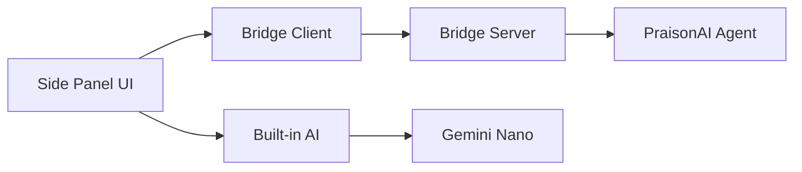

# Chrome Extension

A Chrome Extension that enables AI-powered browser automation through the Chrome DevTools Protocol (CDP).

## Overview

**Architecture:** Chrome Extension ↔ WebSocket ↔ Bridge Server ↔ PraisonAI Agent



## Installation

### From Source

1. Clone the repository:
```bash
git clone https://github.com/MervinPraison/praisonai-chrome-extension.git
cd praisonai-chrome-extension
```

2. Install dependencies:
```bash
npm install
```

3. Build the extension:
```bash
npm run build
```

4. Load in Chrome:
   - Open `chrome://extensions`
   - Enable "Developer mode"
   - Click "Load unpacked"
   - Select the `dist` folder

## Features

### CDP Client

Direct browser control via Chrome DevTools Protocol:

```typescript
import { CDPClient } from './cdp/client';

const client = new CDPClient(tabId);
await client.attach();

// Execute actions
await client.click('#submit-button');
await client.type('#search-input', 'query');
await client.scroll(500);
await client.captureScreenshot();
```

### Built-in AI (Gemini Nano)

On-device AI for privacy-first automation:

```typescript
import { getBuiltInAI } from './ai/builtin';

const session = await getBuiltInAI();
const response = await session.prompt('Click the login button');
```

### Hybrid Mode

Automatic fallback between bridge server and on-device AI:

```typescript
import { getHybridAI } from './ai/hybrid';

const ai = getHybridAI({
  bridgeServerUrl: 'ws://localhost:8765/ws',
  fallbackToBuiltIn: true,
});

await ai.initialize();
await ai.startSession('Search for Python tutorials');
```

## Project Structure

```
praisonai-chrome-extension/
├── src/
│   ├── background/     # Service worker
│   ├── sidepanel/      # Side panel UI
│   ├── content/        # Content scripts
│   ├── cdp/            # CDP client
│   ├── ai/             # AI modules
│   │   ├── builtin.ts  # Gemini Nano
│   │   ├── agent.ts    # Browser agent
│   │   └── hybrid.ts   # Hybrid mode
│   ├── bridge/         # Bridge server client
│   │   ├── client.ts   # WebSocket client
│   │   └── protocol.ts # Message types
│   └── offscreen/      # Offscreen document
├── tests/              # Test files
├── public/             # Static assets
└── manifest.json       # Extension manifest
```

## Keyboard Shortcuts

| Shortcut | Action |
|----------|--------|
| `Ctrl+Shift+P` | Toggle side panel |
| `Alt+A` | Start agent |
| `Alt+S` | Capture screenshot |

Mac users: Use `Cmd` instead of `Ctrl`

## Side Panel

The side panel provides:

- **Goal input**: Enter your automation task
- **Status display**: Real-time progress updates
- **Action log**: See what the agent is doing
- **Controls**: Start/stop automation

## Bridge Server Connection

Connect to the PraisonAI bridge server for cloud LLM access:

1. Start the server:
```bash
praisonai browser start --port 8765
```

2. The extension will automatically connect to `ws://localhost:8765/ws`

3. If connection fails, it falls back to on-device Gemini Nano

## Configuration

### Extension Settings

```javascript
// In storage.local
{
  "bridgeServerUrl": "ws://localhost:8765/ws",
  "preferBridge": true,
  "fallbackToBuiltIn": true,
  "maxSteps": 20,
  "screenshotQuality": 80
}
```

### Environment

| Setting | Default | Description |
|---------|---------|-------------|
| `bridgeServerUrl` | `ws://localhost:8765/ws` | Bridge server WebSocket URL |
| `preferBridge` | `true` | Prefer bridge over built-in AI |
| `maxSteps` | `20` | Maximum automation steps |

## Development

### Build Commands

```bash
npm run dev      # Development build with watch
npm run build    # Production build
npm run test     # Run tests
npm run lint     # Check code style
```

### Testing

```bash
npm test
```

Tests cover:
- CDP client operations
- AI modules
- Message protocols

## Permissions

The extension requires:

- `debugger`: For CDP access
- `activeTab`: Current tab interaction
- `storage`: Settings persistence
- `sidePanel`: Side panel UI
- `contextMenus`: Right-click menus

## Troubleshooting

### Extension Not Working

1. Check that developer mode is enabled
2. Verify all permissions are granted
3. Try reloading the extension

### Bridge Connection Failed

1. Ensure server is running: `praisonai browser start`
2. Check firewall settings
3. Extension will fall back to on-device AI

### Built-in AI Unavailable

Chrome Built-in AI (Gemini Nano) requires:
- Chrome 127+ with Canary features enabled
- `chrome://flags/#optimization-guide-on-device-model` = Enabled
