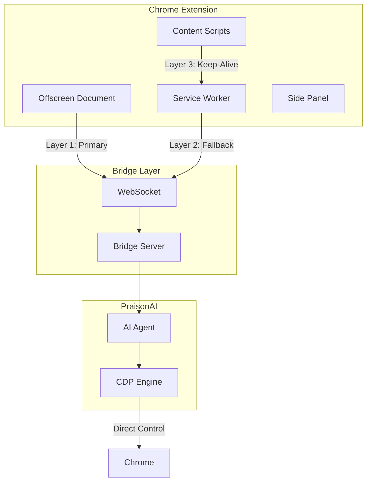

# Chrome Extension

A Chrome Extension that enables AI-powered browser automation through the Chrome DevTools Protocol (CDP) with multi-layer persistence for reliable connections.

## Architecture Overview

The extension uses a **multi-layer architecture** to ensure reliable browser automation:



## Multi-Layer Connection Strategy

Chrome Manifest V3 service workers terminate after 30 seconds of inactivity, which can kill WebSocket connections. We use a **three-layer approach** to maintain persistent connections:

### Layer 1: Offscreen Document (PRIMARY)

The offscreen document is the **primary** method for maintaining WebSocket connections:

```typescript
// Service worker creates offscreen document
await chrome.offscreen.createDocument({
    url: 'offscreen.html',
    reasons: [chrome.offscreen.Reason.BLOBS],
    justification: 'Persistent WebSocket connection for bridge server',
});
```

**Why Offscreen Document?**
- Lives longer than service workers
- Can maintain WebSocket connections indefinitely
- Auto-reconnects when bridge server restarts
- Sends heartbeats to keep connection alive

### Layer 2: Service Worker Bridge (FALLBACK)

If the offscreen document fails, the service worker maintains its own WebSocket:

```typescript
// Falls back to service worker bridge
bridgeClient = getBridgeClient({
    serverUrl: 'ws://localhost:8765/ws',
    maxReconnectAttempts: 3,
});
```

**When Used:**
- Offscreen document creation fails
- Chrome doesn't support offscreen API
- Temporary connection until offscreen is ready

### Layer 3: Content Script Keep-Alive (BACKUP)

Content scripts open persistent ports to keep the service worker alive:

```typescript
// Content script opens keep-alive port
const port = chrome.runtime.connect({ name: 'keepAlive' });

// Ping every 4.5 minutes (Chrome's 5-minute limit)
setInterval(() => port.postMessage({ type: 'ping' }), 270000);
```

## Browser Automation Engines

### Extension Mode (PRIMARY)

Extension mode uses the WebSocket bridge for AI-driven browser automation:

```bash
praisonai browser launch "search for AI" --engine extension
```

**How it works:**
1. Bridge server starts on `localhost:8765`
2. Chrome launches with extension loaded
3. Extension connects to bridge via WebSocket
4. AI agent sends actions, extension executes them

**Advantages:**
- ✅ Full browser context (cookies, sessions)
- ✅ Access to all tabs
- ✅ User-like interactions

### CDP Mode (FALLBACK)

CDP mode uses direct Chrome DevTools Protocol for reliable automation:

```bash
praisonai browser launch "search for AI" --engine cdp
```

**How it works:**
1. Chrome launches with `--remote-debugging-port`
2. Python connects directly via CDP
3. No extension needed
4. Direct browser control

**Advantages:**
- ✅ Always reliable
- ✅ No extension required
- ✅ Faster for simple tasks

## Browser Subagent

The browser subagent is a **specialized AI agent** that handles browser interactions:

```python
# Browser subagent usage
result = browser_subagent(
    Task="Navigate to google.com and search for AI",
    TaskName="Google Search",
    RecordingName="search_demo"
)
```

### What Is It?

The browser subagent is a secondary agent with browser-specific tools:
- `click` - Click elements
- `type` - Enter text
- `navigate` - Go to URLs
- `scroll` - Scroll pages
- `screenshot` - Capture screenshots
- `wait` - Wait for elements

### How It's Used

1. **Main agent** delegates browser tasks to browser subagent
2. **Browser subagent** uses CDP to control Chrome
3. **Results** returned to main agent

### Is It a Fallback?

**No** - The browser subagent is the **main agent** for browser control. It's used by both:
- Extension mode (via WebSocket bridge)
- CDP mode (direct control)

## Technology Stack

| Component | Technology | Purpose |
|-----------|------------|---------|
| Extension | Chrome Manifest V3 | Browser integration |
| Persistence | Offscreen Document API | Long-lived WebSocket |
| Communication | WebSocket | Real-time bidirectional |
| Control | CDP (DevTools Protocol) | Direct browser manipulation |
| AI | PraisonAI Agent | Decision making |

## Project Structure

```
praisonai-chrome-extension/
├── src/
│   ├── background/     # Service worker (Layer 2)
│   │   └── index.ts    # Bridge connection, CDP, agents
│   ├── offscreen/      # Offscreen document (Layer 1)
│   │   └── index.ts    # Persistent WebSocket
│   ├── content/        # Content scripts (Layer 3)
│   │   └── index.ts    # Keep-alive ports
│   ├── sidepanel/      # Side panel UI
│   ├── cdp/            # CDP client library
│   ├── bridge/         # WebSocket bridge client
│   └── ai/             # AI modules (Gemini Nano)
├── dist/               # Built extension
└── manifest.json       # Extension manifest
```

## Installation

### From Source

1. Clone and build:
```bash
git clone https://github.com/MervinPraison/praisonai-chrome-extension.git
cd praisonai-chrome-extension
npm install
npm run build
```

2. Load in Chrome:
   - Open `chrome://extensions`
   - Enable "Developer mode"
   - Click "Load unpacked"
   - Select the `dist` folder

### Via CLI

The CLI automatically loads the extension:

```bash
praisonai browser launch "search for AI" --engine extension
```

## Keyboard Shortcuts

| Shortcut | Action |
|----------|--------|
| `Ctrl+Shift+P` | Toggle side panel |
| `Alt+A` | Start agent |
| `Alt+S` | Capture screenshot |

Mac users: Use `Cmd` instead of `Ctrl`

## Configuration

```javascript
// Extension settings (storage.local)
{
    "bridgeServerUrl": "ws://localhost:8765/ws",
    "preferBridge": true,
    "fallbackToBuiltIn": true,
    "maxSteps": 20
}
```

## Troubleshooting

### Extension Not Connecting

If you see "Timeout after 30s" errors:

1. **Check bridge server:**
   ```bash
   curl http://localhost:8765/health
   ```

2. **Check extension console:**
   - Go to `chrome://extensions`
   - Find "PraisonAI Browser Agent"
   - Click "Inspect views: service worker"
   - Look for connection errors

3. **Use CDP fallback:**
   ```bash
   praisonai browser launch "search for AI" --engine cdp
   ```

### "Receiving End Does Not Exist" Error

This occurs when the offscreen document isn't ready. The extension now:
- Waits 1 second after creating offscreen document
- Retries 3 times with 500ms delay
- Falls back to service worker bridge

### Chrome Instance Management

The CLI only manages its own Chrome instance:
- ✅ Only kills the Chrome window it launched
- ✅ Does NOT kill your manually opened Chrome windows
- ✅ Reuses existing session when possible

## Permissions

The extension requires:

| Permission | Purpose |
|------------|---------|
| `debugger` | CDP access for automation |
| `offscreen` | Persistent WebSocket |
| `activeTab` | Current tab interaction |
| `storage` | Settings persistence |
| `sidePanel` | Side panel UI |
| `<all_urls>` | Page interaction |

## Development

```bash
npm run dev      # Development build with watch
npm run build    # Production build
npm run test     # Run tests
npm run lint     # Check code style
```
